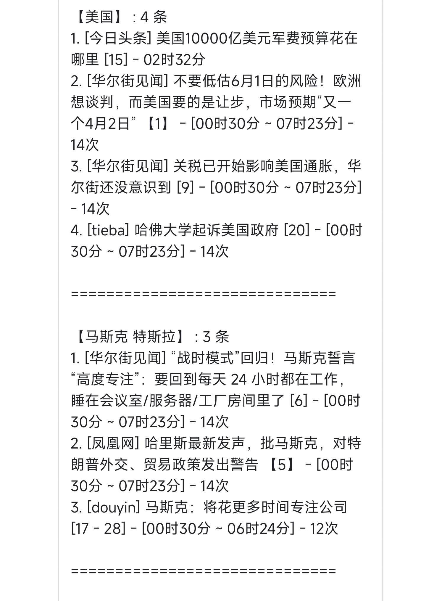
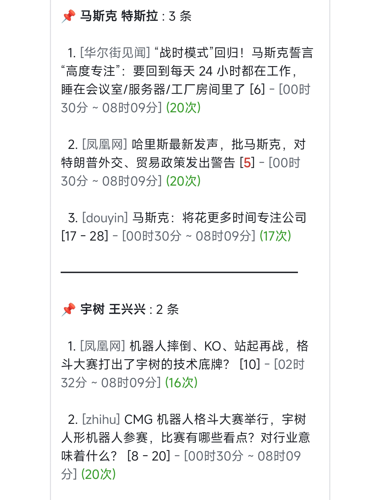
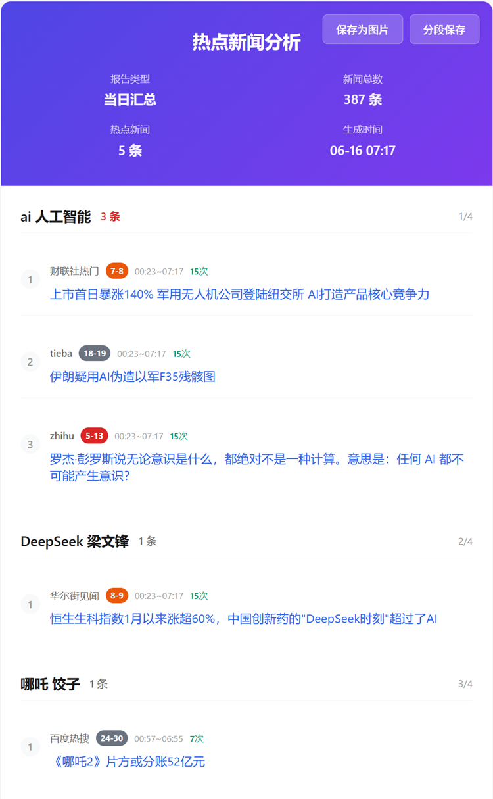
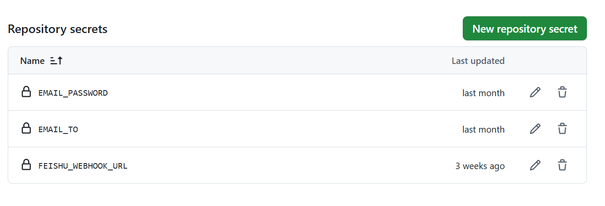
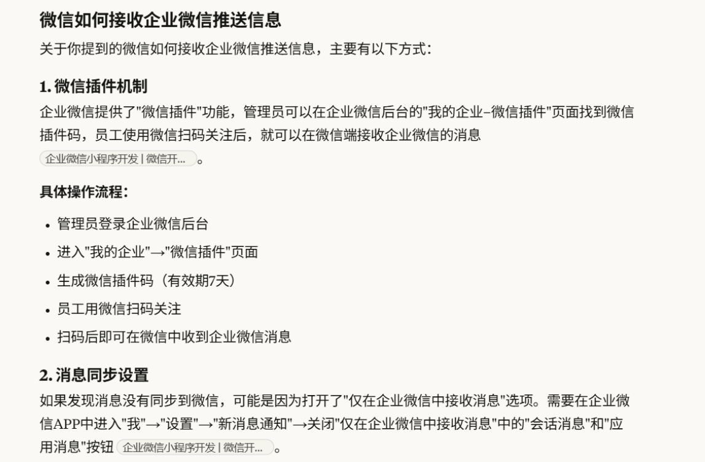
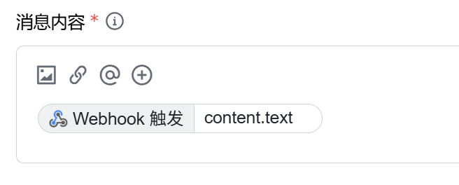
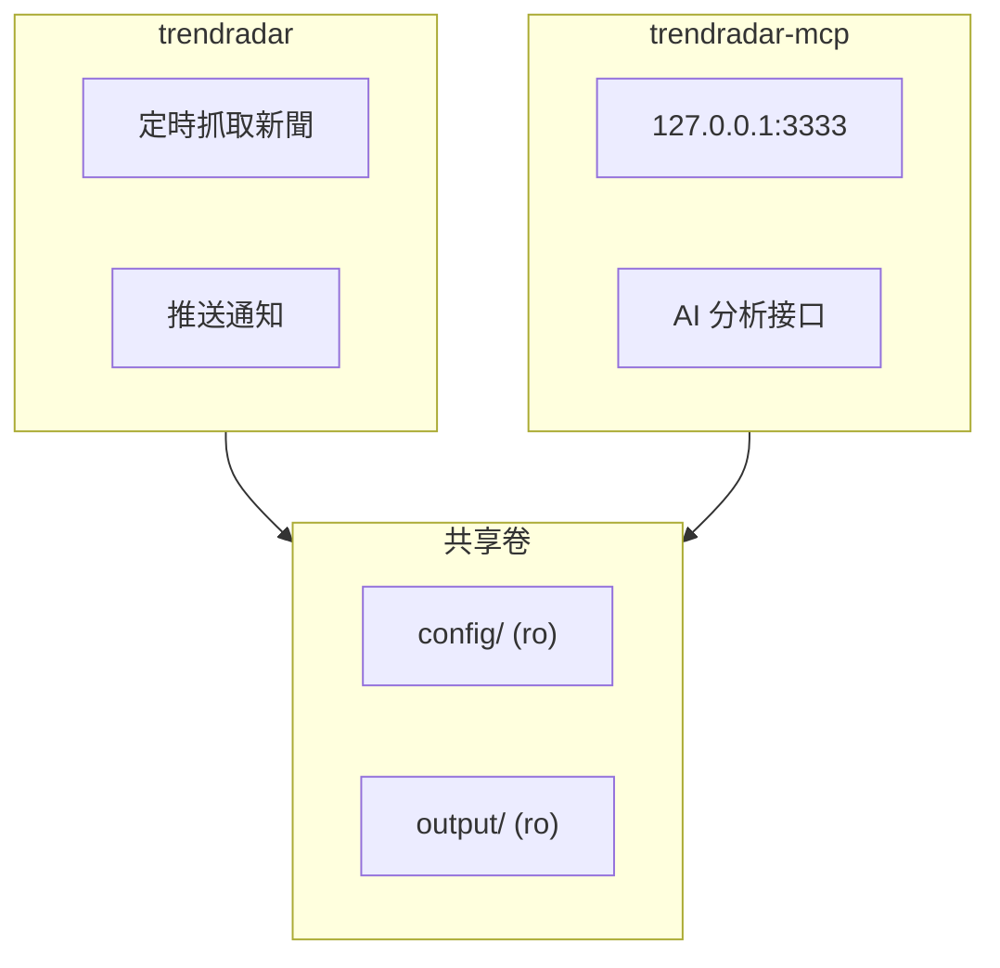

<div align="center" id="trendradar">

<a href="https://github.com/sansan0/TrendRadar" title="TrendRadar">
  
</a>

最快<strong>30秒</strong>部署的熱點助手 —— 告別無效刷屏，只看真正關心的新聞資訊

<a href="https://trendshift.io/repositories/14726" target="_blank"></a>


[](https://github.com/sansan0/TrendRadar/stargazers)
[](https://github.com/sansan0/TrendRadar/network/members)
[](LICENSE)
[](https://github.com/sansan0/TrendRadar)
[](https://github.com/sansan0/TrendRadar)
[](https://github.com/sansan0/TrendRadar)
[](https://github.com/sansan0/TrendRadar)

[](https://work.weixin.qq.com/)
[](https://weixin.qq.com/)
[](https://telegram.org/)
[](#)
[](https://www.feishu.cn/)
[](#)
[](https://github.com/binwiederhier/ntfy)
[](https://github.com/Finb/Bark)
[](https://slack.com/)
[](#)


[](https://github.com/sansan0/TrendRadar)
[](https://sansan0.github.io/TrendRadar)
[](https://hub.docker.com/r/wantcat/trendradar)
[](https://modelcontextprotocol.io/)
[](#)
[](#)

</div>

<div align="center">

**中文** | **[English](README-EN.md)**

</div>

> 本專案以輕量，易部署為目標

<br>

## 📑 快速導航

> 💡 **點擊下方連結**可快速跳轉到對應章節。部署推薦從「**快速開始**」入手，需要詳細自定義請看「**設定詳解**」

<div align="center">

|   |   |   |
|:---:|:---:|:---:|
| [🚀 **快速開始**](#-快速開始) | [AI 智能分析](#-ai-智能分析) | [⚙️ **設定詳解**](#設定詳解) |
| [Docker部署](#6-docker-部署) | [MCP用戶端](#-mcp-用戶端) | [📝 **更新日誌**](#-更新日誌) |
| [🎯 **核心功能**](#-核心功能) | [☕ **支援項目**](#-支援項目) | [📚 **項目相關**](#-項目相關) |

</div>

<br>

- 感謝**為項目點 star** 的觀眾們，**fork** 你所欲也，**star** 我所欲也，兩者得兼😍是對開源精神最好的支援

<details>
<summary>👉 點擊展開：<strong>致謝名單</strong> (天使輪榮譽榜 🔥73+🔥 位)</summary>

### 早期支援者致謝

> 💡 **特別說明**：
>
> 1. **關於名單**：下方表格記錄了項目起步階段（天使輪）的支援者。因早期人工統計繁瑣，**難免存在疏漏或記錄不全的情況，如有遺漏，實非本意，萬望海涵**。
> 2. **未來規劃**：為了將有限的精力回歸代碼與功能迭代，**即日起不再人工維護此名單**。
>
> 無論名字是否上榜，你們的每一份支援都是 TrendRadar 能夠走到今天的基石。🙏

### 基礎設施支援

感謝 **GitHub** 免費提供的基礎設施，這是本專案得以**一鍵 fork**便捷運行的最大前提。

### 數據支援

本專案使用 [newsnow](https://github.com/ourongxing/newsnow) 項目的 API 獲取多平臺數據，特別感謝作者提供的服務。

經聯繫，作者表示無需擔心伺服器壓力，但這是基於他的善意和信任。請大家：
- **前往 [newsnow 項目](https://github.com/ourongxing/newsnow) 點 star 支援**
- Docker 部署時，請合理控制推送頻率，勿竭澤而漁

### 推廣助力

> 感謝以下平臺和個人的推薦(按時間排列)

- [小眾軟體](https://mp.weixin.qq.com/s/fvutkJ_NPUelSW9OGK39aA) - 開源軟體推薦平臺
- [LinuxDo 社區](https://linux.do/) - 技術愛好者的聚集地
- [阮一峰周刊](https://github.com/ruanyf/weekly) - 技術圈有影響力的周刊

### 觀眾支援

> 感謝**給予資金支援**的朋友們，你們的慷慨已化身為鍵盤旁的零食飲料，陪伴著項目的每一次迭代。
>
> **關於"一元點讚"的回歸**：
> 隨著 v5.0.0 版本的發布，項目邁入了一個新的階段。為了支援日益增長的 API 成本和咖啡因消耗，"一元點讚"通道現已重新開啟。你的每一份心意，都將轉化為代碼世界裡的 Token 和動力。🚀 [前往支援](#-支援項目)

|           點讚人            |  金額  |  日期  |             備註             |
| :-------------------------: | :----: | :----: | :-----------------------: |
|           D*5          |  1.8 * 3 | 2025.11.24  |    | 
|           *鬼          |  1 | 2025.11.17  |    | 
|           *超          |  10 | 2025.11.17  |    | 
|           R*w          |  10 | 2025.11.17  | 這 agent 做的牛逼啊,兄弟    | 
|           J*o          |  1 | 2025.11.17  | 感謝開源,祝大佬事業有成    | 
|           *晨          |  8.88  | 2025.11.16  | 項目不錯,研究學習中    | 
|           *海          |  1  | 2025.11.15  |    | 
|           *德          |  1.99  | 2025.11.15  |    | 
|           *疏          |  8.8  | 2025.11.14  |  感謝開源，項目很棒，支援一下   | 
|           M*e          |  10  | 2025.11.14  |  開源不易，大佬辛苦了   | 
|           **柯          |  1  | 2025.11.14  |     | 
|           *雲          |  88  | 2025.11.13  |    好項目，感謝開源  | 
|           *W          |  6  | 2025.11.13  |      | 
|           *凱          |  1  | 2025.11.13  |      | 
|           對*.          |  1  | 2025.11.13  |    Thanks for your TrendRadar  | 
|           s*y          |  1  | 2025.11.13  |      | 
|           **翔          |  10  | 2025.11.13  |   好項目，相見恨晚，感謝開源！     | 
|           *韋          |  9.9  | 2025.11.13  |   TrendRadar超讚，請老師喝咖啡~     | 
|           h*p          |  5  | 2025.11.12  |   支援中國開源力量，加油！     | 
|           c*r          |  6  | 2025.11.12  |        | 
|           a*n          |  5  | 2025.11.12  |        | 
|           。*c          |  1  | 2025.11.12  |    感謝開源分享    | 
|           *記          |  1  | 2025.11.11  |        | 
|           *主          |  1  | 2025.11.10  |        | 
|           *了          |  10  | 2025.11.09  |        | 
|           *傑          |  5  | 2025.11.08  |        | 
|           *點          |  8.80  | 2025.11.07  |   開發不易，支援一下。     | 
|           Q*Q          |  6.66  | 2025.11.07  |   感謝開源！     | 
|           C*e          |  1  | 2025.11.05  |        | 
|           Peter Fan          |  20  | 2025.10.29  |        | 
|           M*n          |  1  | 2025.10.27  |      感謝開源  | 
|           *許          |  8.88  | 2025.10.23  |      老師 小白一枚，摸了幾天了還沒整起來，求教  | 
|           Eason           |  1  | 2025.10.22  |      還沒整明白，但你在做好事  | 
|           P*n           |  1  | 2025.10.20  |          |
|           *傑           |  1  | 2025.10.19  |          |
|           *徐           |  1  | 2025.10.18  |          |
|           *志           |  1  | 2025.10.17  |          |
|           *😀           |  10  | 2025.10.16  |     點讚     |
|           **傑           |  10  | 2025.10.16  |          |
|           *嘯           |  10  | 2025.10.16  |          |
|           *紀           |  5  | 2025.10.14  | TrendRadar         |
|           J*d           |  1  | 2025.10.14  | 謝謝你的工具，很好玩...          |
|           *H           |  1  | 2025.10.14  |           |
|           那*O           |  10  | 2025.10.13  |           |
|           *圓           |  1  | 2025.10.13  |           |
|           P*g           |  6  | 2025.10.13  |           |
|           Ocean           |  20  | 2025.10.12  |  ...真的太棒了！！！小白級別也能直接用...         |
|           **培           |  5.2  | 2025.10.2  |  github-yzyf1312:開源萬歲         |
|           *椿           |  3  | 2025.9.23  |  加油，很不錯         |
|           *🍍           |  10  | 2025.9.21  |           |
|           E*f           |  1  | 2025.9.20  |           |
|           *記            |  1  | 2025.9.20  |           |
|           z*u            |  2  | 2025.9.19  |           |
|           **昊            |  5  | 2025.9.17  |           |
|           *號            |  1  | 2025.9.15  |           |
|           T*T            |  2  | 2025.9.15  |  點讚         |
|           *家            |  10  | 2025.9.10  |           |
|           *X            |  1.11  | 2025.9.3  |           |
|           *飆            |  20  | 2025.8.31  |  來自老童謝謝         |
|           *下            |  1  | 2025.8.30  |           |
|           2*D            |  88  | 2025.8.13 下午 |           |
|           2*D            |  1  | 2025.8.13 上午 |           |
|           S*o            |  1  | 2025.8.05 |   支援一下        |
|           *俠            |  10  | 2025.8.04 |           |
|           x*x            |  2  | 2025.8.03 |  trendRadar 好項目 點讚          |
|           *遠            |  1  | 2025.8.01 |            |
|           *邪            |  5  | 2025.8.01 |            |
|           *夢            |  0.1  | 2025.7.30 |            |
|           **龍            |  10  | 2025.7.29 |      支援一下      |


</details>

<br>

## 🪄 贊助商

<div align="center">

> **虛位以待**
>
> 有意贊助？在微信公眾號中觸發自動回復，即可獲取我的聯繫方式

</div>

<br>

<a name="-支援項目"></a>

### ❤️ 覺得好用？支援一下

> 若 TrendRadar 曾為你捕捉價值，不妨為它注入動力，助其持續進化
>
> 金額隨意，1 元也是對開源的鼓勵。歡迎在讚賞時備註留言 (´▽`ʃ♡ƪ)

<div align="center">

| 微信讚賞 | 支付寶讚賞 |
|:---:|:---:|
|  |  |

</div>


### 🤝 二次開發與引用

如果你在項目中使用或借鑑了本專案的思路、核心代碼，**非常歡迎**在 README 或文檔中註明來源並附上本倉庫連結。

這將有助於項目的持續維護和社區發展，感謝你的尊重與支援！❤️


### 💬 交流與反饋

- **GitHub Issues**：適合具體的技術問題。提問時請提供完整信息（截圖、錯誤日誌等），有助於快速定位。
- **公眾號交流**：建議優先在相關文章下的留言區交流。若需後臺提問，**先點讚/推薦**文章是最好的"敲門磚"，我在後臺都能感受到這份心意喲 (´▽`ʃ♡ƪ)。
- **QQ 群交流**：關注公眾號，回復「**交流群**」即可加入。無論你是 AI 小白還是硬核開發者，想求助技術問題還是分享折騰心得，這裡都歡迎你。群裡主打互助交流和靈感碰撞，入群請先看群公告；提問時描述清楚問題、附上截圖，群友有空就會幫忙，大家的實戰經驗往往比我一個人更快更全面 🤝

> **友情提示**：
> 本專案為開源分享，非商業產品。把作者當朋友而非客服，溝通效率會更高哦！

<div align="center">

|公眾號關注 |
|:---:|
|  |

</div>

<br>

## 📝 更新日誌

> **📌 查看最新更新**：**[原倉庫更新日誌](https://github.com/sansan0/TrendRadar?tab=readme-ov-file#-更新日誌)** ：
- **提示**：建議查看【歷史更新】，明確具體的【功能內容】


### 2026/06/02 - v6.9.0

- **熱榜域名安全校驗**：新增 `expected_domain` 設定項，校驗返回數據連結的域名合法性，不匹配時自動丟棄數據並警告，有效防範連結劫持或數據篡改
- **自定義熱榜 API 地址**：支援自部署 newsnow 並設定 `api_url` 使用自己的數據源

### 2026/02/09 - mcp-v4.0.0

- **🔥 AI 消息直推所有渠道**：讓 AI 寫好的內容一鍵推送到飛書、釘釘、Telegram、郵件等 9 個渠道，Markdown 自動適配各平臺格式，不用操心格式差異
- **新增格式化策略指南**：新增 `get_channel_format_guide` 工具，告訴 AI 每個渠道支援什麼格式、有什麼限制，生成的內容排版更好看
- **智能分批發送**：超長消息自動按各渠道字節限制拆分（飛書 30KB、釘釘 20KB 等），設定讀取自 config.yaml
- **修復渠道誤檢測**：ntfy 不再因為預設地址被誤報為"已設定"
- **代碼復用優化**：批次處理函數直接復用 trendradar 核心模塊，不重複造輪子


<details>
<summary>👉 點擊展開：<strong>歷史更新</strong></summary>

### 2026/05/23 - v6.8.0

- **HTML 報告全面增強**：新增報告元數據展示（生成時間、數據來源、版本號）、暗色模式自動適配、Tab 欄交互優化、趨勢箭頭可視化，瀏覽器閱讀體驗大幅提升
- **版本檢查 CDN 多源回退**：版本檢查接口支援 GitHub → jsDelivr → Cloudflare 等多個 CDN 源自動回退，國內網路環境也能穩定獲取更新提示
- **展示區域開關生效**：HTML 報告和郵件現在正確尊重 `display.regions.ai_analysis` 和 `display.regions.standalone` 開關，關閉即不渲染
- **導出按鈕修復**：修復導出按鈕點擊後下拉菜單圖標消失的問題
- **Markdown 導出修復**：修復 HTML 報告 Markdown 導出中 JS 換行符轉義錯誤

### 2026/05/15 - v6.7.0

- **Markdown 導出**：報告導出下拉菜單新增 Markdown 格式，一鍵生成帶連結的結構化文本，方便 LLM 二次加工和跨平臺分享（[#1121](https://github.com/sansan0/TrendRadar/issues/1121)）
- **RSS guid 去重**：RSS 存儲新增 guid 欄位，去重優先級改為 guid > url，解決同一文章因 URL 變化導致重複入庫的問題
- **空標題防護**：解析器、渲染層、翻譯回填全鏈路增加空標題兜底邏輯，確保無標題條目也能正常顯示
- **翻譯質量增強**：翻譯提示詞要求保留編號順序，空翻譯結果不再覆蓋原始標題

### 2026/03/28 - v6.6.0

- **HTML 報告瀏覽器增強**：在瀏覽器中打開報告可自動切換寬屏布局，關鍵詞分組和獨立展區均支援 Tab 快速切換，搜索框實時過濾新聞標題，郵件用戶端仍顯示原始窄屏布局，零回歸
- **暗色模式**：一鍵切換深色主題，自動記住偏好，適合夜間閱讀
- **一鍵複製新聞**：滑鼠懸停新聞序號即可複製標題和連結，方便快速分享
- **導出優化**：整頁截圖和分段截圖合併為下拉式導出按鈕，截圖時自動還原乾淨布局
- **快捷鍵系統**：支援 `W` 寬屏切換、`D` 暗色模式、`/` 搜索、`?` 查看快捷鍵提示
- **閱讀進度條**：頁面頂部實時顯示閱讀進度

### 2026/03/12 - v6.5.0

- **AI 智能篩選系統**：不用再手動設關鍵詞！在 `ai_interests.txt` 裡用日常語言寫下你關注的方向（如"我想看 AI 和新能源相關新聞"），AI 會自動提取標籤並對每條新聞打分，只推送真正和你相關的內容。萬一 AI 篩選出了問題，會自動切回關鍵詞匹配，推送不中斷
- **每個時段支援不同的篩選方式和關注方向**：Timeline 中的每個時間段現在可以獨立設置用什麼方式篩選、看什麼類型的新聞。比如：早上用"科技關鍵詞"快速過濾，晚上換成"金融 AI 興趣描述"做深度篩選——同一個系統，不同時段看不同內容
- **AI 分析範圍獨立於推送**：AI 分析的數據範圍可以和推送內容不同。比如推送只發新增消息（避免重複打擾），但 AI 分析當天全部新聞（看完整趨勢）。每個時段也能單獨設置 AI 分析模式
- **AI 篩選智能省錢**：已分析過的新聞不會重複消耗 token；興趣描述修改後，AI 自動判斷變化幅度——小改動只更新受影響的標籤，大改動才全量重新分類
- **多檔案設定與標籤隔離**：自定義關鍵詞檔案放 `config/custom/keyword/`，AI 興趣檔案放 `config/custom/ai/`，不同檔案產生的標籤各自獨立、互不幹擾
- **AI 翻譯精準控制**：可分別控制熱榜、RSS、獨立展示區是否翻譯，沒開啟顯示的區域自動跳過，不浪費 token
- **遠程存儲批量上傳**：多次寫操作攢在一起統一提交雲端，減少 API 調用次數
- **每組關鍵詞/標籤展示數量限制**：通過 `max_news_per_keyword` 控制每個分組最多顯示多少條新聞，避免單個熱門話題佔滿整條推送
- **時段衝突智能檢測**：兩個時間段如果有時間重疊，系統會自動報錯提醒修改，避免設定衝突導致意外行為
- 修復若干bug

### 2026/02/09 - v6.0.0

> **Breaking Change**：設定檔案升級（config.yaml 2.0.0），舊版 `push_window` 和 `analysis_window` 設定不再兼容，請參考新版 config.yaml 遷移

- **統一調度系統**：新增 `timeline.yaml`，用一套設定控制「什麼時間採集 / 推送 / AI 分析」
- **5 種預設模板**：`always_on`（全天候，預設）、`morning_evening`（早晚匯總）、`office_hours`（辦公時間）、`night_owl`（夜貓子）、`custom`（自定義）；也支援在 `presets:` 下新增自己的模板，只要 key 不重複，然後在 config.yaml 裡填你的模板名即可
- **靈活的時間段設定**：支援工作日/周末差異化、跨午夜時間段、per-period once 去重
- **可視化設定編輯器**：
  - 新增 `timeline.yaml` 編輯標籤頁，與 config.yaml / frequency_words.txt 並列
  - 預設模式卡片選擇：點擊即切換，自動同步 config.yaml 的 `schedule.preset`
  - 周視圖時間線：7 天 × 24 小時水平條，用顏色區分推送/分析/採集狀態
  - 可交互控制項：開關、下拉框、時間選擇器，右側修改實時同步到左側 YAML
  - 周映射下拉選擇：根據日計劃動態填充，拖拉點擊即可完成調度設定
- **AI 提示詞穩定性優化**（ai_analysis_prompt.txt v2.0.0）：
  - 格式規範獨立說明：將換行/標籤/序號/禁止事項從 JSON value 中抽出，作為獨立章節
  - JSON 模板簡化：欄位描述縮短為一句話 + 字數限制，減少 AI 輸出格式混亂
  - 去除 system prompt 中的 Markdown 格式，與"禁止 Markdown"指令保持一致
  - 所有 JSON 欄位聲明為可選，缺少任何欄位不會報錯，增強容錯性
- **新增獨立展示區 AI 概括分析**（`ai_analysis.include_standalone`）：
  - 新增獨立開關，開啟後 AI 對每個 standalone 源生成核心概括
  - AI 分析與推送展示解耦：無需開啟獨立展示區的推送顯示，AI 也可獨立分析完整熱榜數據
  - 支援熱榜平臺和 RSS 源，含排名/時間/軌跡數據
  - 軌跡分析與 `include_rank_timeline` 聯動：開啟時利用軌跡數據做深度趨勢分析，關閉時基於排名做簡要判斷
  - 新增 `standalone_summaries` JSON 欄位（獨立源點速覽），所有推送渠道均已適配渲染


### 2026/01/28 - v5.5.0

> 和 mcp 功能一樣, 這個小工具我也不新開一個倉庫維護了, 反正純前端, 都擱一起吧

- 增加 trendradar 的可視化設定編輯器


### 2026/02/02 - mcp-v3.2.0

- **新增 read_article 工具**：通過 Jina AI Reader 讀取單篇文章正文（Markdown 格式）
- **新增 read_articles_batch 工具**：批量讀取多篇文章（最多 5 篇，自動限速）
- **推薦工作流**：`search_news(query="關鍵詞", include_url=True)` → `read_article(url=...)` 讀取正文
- **文檔更新**：README-MCP-FAQ.md 和 README-MCP-FAQ-EN.md 新增 Q19-Q20 文章讀取相關說明


### 2026/01/10 - mcp-v3.0.0~v3.1.5

- **Breaking Change**：所有工具返回值統一為 `{success, summary, data, error}` 結構
- **異步一致性**：所有 21 個工具函數使用 `asyncio.to_thread()` 包裝同步調用
- **MCP Resources**：新增 4 個資源（platforms、rss-feeds、available-dates、keywords）
- **RSS 增強**：`get_latest_rss` 支援多日查詢（days 參數），跨日期 URL 去重
- **正則匹配修復**：`get_trending_topics` 支援 `/pattern/` 正則語法和 `display_name`
- **緩存優化**：新增 `make_cache_key()` 函數，參數排序+MD5 哈希確保一致性
- **新增 check_version 工具**：支援同時檢查 TrendRadar 和 MCP Server 版本更新


### 2026/01/23 - v5.4.0

- 增加 AI 分析模式的獨立控制功能，可選 follow_report | daily | current | incremental 
- 新增 AI 分析時間窗口控制，支援自定義運行段及每日頻次限制
- 增加設定檔案版本管理功能
- 修復若干bug


### 2026/01/19 - v5.3.0

> **重大重構：AI 模塊遷移至 LiteLLM**

- **統一 AI 接口**：使用 LiteLLM 替代手動實現，支援 100+ AI 提供商
- **簡化設定**：移除 `provider` 欄位，改用 `model: "provider/model_name"` 格式
- **新增功能**：自動重試 (`num_retries`)、備用模型 (`fallback_models`)
- **設定變更**：
  - `ai.provider` → 移除（已合併到 model）
  - `ai.base_url` → `ai.api_base`
  - `AI_PROVIDER` 環境變量 → 移除
  - `AI_BASE_URL` 環境變量 → `AI_API_BASE`
- **模型格式示例**：
  - DeepSeek: `deepseek/deepseek-chat`
  - OpenAI: `openai/gpt-4o`
  - Gemini: `gemini/gemini-2.5-flash`
  - Anthropic: `anthropic/claude-3-5-sonnet`

### 2026/01/17 - v5.2.0

> 主要見 config.yaml 描述

**🌐 AI 翻譯功能**

- **多語言翻譯**：支援將推送內容翻譯為任意語言
- **批量翻譯**：智能批量處理，減少 API 調用次數
- **自定義提示詞**：支援自定義翻譯風格

**🔧 設定架構優化**

- **AI 模型設定獨立**：分析和翻譯共享模型設定
- **區域開關統一**：統一管理推送區域顯示
- **區域排序自定義**：支援自定義各區域的顯示順序

**✨ AI 分析增強**

- **AI 分析嵌入 HTML**：分析結果直接嵌入 HTML 報告，郵件通知直接使用
- **富樣式 AI 區塊**：漸變藍色背景卡片式布局，清晰分隔各分析維度
- **排名時間線支援**：AI 可獲取每條新聞在每個抓取時間點的精確排名
- **板塊重組 (7→4)**：整合為核心熱點態勢、輿論風向爭議、異動與弱信號、研判策略建議

**🔧 多模型適配**

- **通用參數透傳**：支援向 API 透傳任意高級參數
- **Gemini 適配**：原生參數支援，內置安全策略放寬

**🐛 Bug 修復**

- 修復若干已知問題，提升系統穩定性

### 2026/01/10 - v5.0.0

> **開發小插曲**：
> 致敬那個陪伴我兩年多、卻在剛續費後反手彈出 `"This organization has been disabled"` 的某 C 廠模型

**✨ 推送內容"五大板塊"重構**

本次更新對推送消息進行了區域化重構，現在推送內容清晰地劃分為五大核心板塊：

1.  **📊 熱榜新聞**：根據你的關鍵詞精準篩選後的全網熱點聚合。
2.  **📰 RSS 訂閱**：你的個性化訂閱源內容，支援按關鍵詞分組。
3.  **🆕 本次新增**：實時捕捉自上次運行以來的全新熱點（帶 🆕 標記）。
4.  **📋 獨立展示區**：指定平臺的完整熱榜或 RSS 源展示，**完全不受關鍵詞過濾限制**。
5.  **✨ AI 分析板塊**：由 AI 驅動的深度洞察，包含趨勢概述、熱度走勢及**極其重要**的情感傾向分析。

**✨ AI 智能分析推送功能**

- **AI 分析集成**：使用 AI 大模型對推送內容進行深度分析，自動生成熱點趨勢概述、關鍵詞熱度分析、跨平臺關聯、潛在影響評估等
- **情感傾向分析**：新增深度情感識別，精準捕捉輿論的正負面、爭議或擔憂情緒
- **多 AI 提供商支援**：支援 DeepSeek（預設，性價比高）、OpenAI、Google Gemini 及任意 OpenAI 兼容接口
- **兩種推送模式**：`only_analysis`（僅 AI 分析）、`both`（兩者都推送）
- **自定義提示詞**：通過 `config/ai_analysis_prompt.txt` 檔案自定義 AI 分析角色和輸出格式
- **多維度數據分析**：AI 可分析排名變化、熱度持續時間、跨平臺表現、趨勢預測等

**📋 獨立展示區功能**

- **完整熱榜展示**：指定平臺的完整熱榜單獨展示，不受關鍵詞過濾影響
- **RSS 獨立展示**：RSS 源內容可完整展示，適合內容較少的訂閱源
- **靈活設定**：支援設定展示平臺列表、RSS 源列表、最大展示條數

**📊 推送體驗重構**

- **排版升級**：重新設計並統一各渠道統計頭部，強化區塊組織，消息層次一目了然
- **設定簡化**：優化飛書等通知渠道的設定邏輯，上手更簡單
- **熱度趨勢箭頭**：新增 🔺(上升)、🔻(下降)、➖(持平) 趨勢標識，直觀展示熱度變化
- **通用 Webhook**：支援自定義 Webhook URL 和 JSON 模板，輕鬆適配 Discord、Matrix、IFTTT 等任意平臺

**🔧 設定優化**

- **頻率詞設定增強**：新增 `[組別名]` 語法，支援 `#` 注釋行，設定更清晰（感謝 [@songge8](https://github.com/sansan0/TrendRadar/issues/752) 提出的建議）
- **環境變量支援**：AI 分析相關設定支援環境變量覆蓋（`AI_API_KEY`、`AI_PROVIDER` 等）

> 💡 詳細設定教程見 [讓 AI 幫我分析熱點](#12-讓-ai-幫我分析熱點)


### 2026/01/02 - v4.7.0

- **修復 RSS HTML 顯示**：修復 RSS 數據格式不匹配導致的渲染問題，現在按關鍵詞分組正確顯示
- **新增正則表達式語法**：關鍵詞設定支援 `/pattern/` 正則語法，解決英文子字符串誤匹配問題（如 `ai` 匹配 `training`）[📖 查看語法詳解](#關鍵詞基礎語法)
- **新增顯示名稱語法**：使用 `=> 備註` 給複雜的正則表達式起個好記的名字，推送消息顯示更清晰（如 `/\bai\b/ => AI相關`）
- **不會寫正則？** README 新增 AI 生成正則的引導，告訴 ChatGPT/Gemini/DeepSeek 你想匹配什麼，讓 AI 幫你寫


### 2025/12/30 - mcp-v2.0.0

- **架構調整**：移除 TXT 支援，統一使用 SQLite 資料庫
- **RSS 查詢**：新增 `get_latest_rss`、`search_rss`、`get_rss_feeds_status`
- **統一搜索**：`search_news` 支援 `include_rss` 參數同時搜索熱榜和 RSS


### 2026/01/01 - v4.6.0

- **修復 RSS HTML 顯示**：將 RSS 內容合併到熱榜 HTML 頁面，按源分組顯示
- **新增 display_mode 設定**：支援 `keyword`（按關鍵詞分組）和 `platform`（按平臺分組）兩種顯示模式


### 2025/12/30 - v4.5.0

- **RSS 訂閱源支援**：新增 RSS/Atom 抓取，按關鍵詞分組統計（與熱榜格式一致）
- **存儲結構重構**：扁平化目錄結構 `output/{type}/{date}.db`
- **統一排序設定**：`sort_by_position_first` 同時影響熱榜和 RSS
- **設定結構重構**：`config.yaml` 重新組織為 7 個邏輯分組（app、report、notification、storage、platforms、rss、advanced），設定路徑更清晰


### 2025/12/26 - mcp-v1.2.0

  **MCP 模塊更新 - 優化工具集，新增聚合對比功能，合併冗餘工具:**
  - 新增 `aggregate_news` 工具 - 跨平臺新聞去重聚合
  - 新增 `compare_periods` 工具 - 時期對比分析（周環比/月環比）
  - 合併 `find_similar_news` + `search_related_news_history` → `find_related_news`
  - 增強 `get_trending_topics` - 新增 `auto_extract` 模式自動提取熱點
  - 修復若干bug
  - 同步更新 README-MCP-FAQ.md 文檔的中英文版 (Q1-Q18)


### 2025/12/20 - v4.0.3

- 新增 URL 標準化功能，解決微博等平臺因動態參數（如 `band_rank`）導致的重複推送問題
- 修復增量模式檢測邏輯，正確識別歷史標題


### 2025/12/17 - v4.0.1

- StorageManager 添加推送記錄代理方法
- S3 用戶端切換至 virtual-hosted style 以提升兼容性（支援騰訊雲 COS 等更多服務）


### 2025/12/13 - mcp-v1.1.0

  **MCP 模塊更新:**
  - 適配 v4.0.0，同時也兼容 v3.x 的數據
  - 新增存儲同步工具：`sync_from_remote`、`get_storage_status`、`list_available_dates`


### 2025/12/13 - v4.0.0

**🎉 重大更新：全面重構存儲和核心架構**

- **多存儲後端支援**：引入全新的存儲模塊，支援本地 SQLite 和遠程雲存儲（S3 兼容協議，例如 Cloudflare R2），適應 GitHub Actions、Docker 和本地環境。
- **資料庫結構優化**：重構 SQLite 資料庫表結構，提升數據效率和查詢能力。
- **核心代碼模塊化**：將主程序邏輯拆分為 trendradar 包的多個模塊，顯著提升代碼可維護性。
- **增強功能**：實現日期格式標準化、數據保留策略、時區設定支援、時間顯示優化，並修復遠程存儲數據持久化問題，確保數據合併的準確性。
- **清理和兼容**：移除了大部分歷史兼容代碼，統一了數據存儲和讀取方式。


### 2025/12/03 - v3.5.0

**🎉 核心功能增強**

1. **多帳號推送支援**
   - 所有推送渠道（飛書、釘釘、企業微信、Telegram、ntfy、Bark、Slack）支援多帳號設定
   - 使用分號 `;` 分隔多個帳號，例如：`FEISHU_WEBHOOK_URL=url1;url2`
   - 自動驗證配對設定（如 Telegram 的 token 和 chat_id）數量一致性

2. **推送區域設定**
   - 通過 `display.region_order` 自定義各區域的顯示順序（v5.2.0 替代原 `reverse_content_order`）
   - 通過 `display.regions` 控制各區域是否顯示（熱榜、新增熱點、RSS、獨立展示區、AI 分析）

3. **全局過濾關鍵詞**
   - 新增 `[GLOBAL_FILTER]` 區域標記，支援全局過濾不想看到的內容
   - 適用場景：過濾廣告、營銷、低質內容等

**🐳 Docker 雙路徑 HTML 生成優化**

- **問題修復**：解決 Docker 環境下 `index.html` 無法同步到宿主機的問題
- **雙路徑生成**：當日匯總 HTML 同時生成到兩個位置
  - `index.html`（項目根目錄）：供 GitHub Pages 訪問
  - `output/index.html`：通過 Docker Volume 掛載，宿主機可直接訪問
- **兼容性**：確保 Docker、GitHub Actions、本地運行環境均能正常訪問網頁版報告

**🐳 Docker MCP 鏡像支援**

- 新增獨立的 MCP 服務鏡像 `wantcat/trendradar-mcp`
- 支援 Docker 部署 AI 分析功能，通過 HTTP 接口（埠 3333）提供服務
- 雙容器架構：新聞推送服務與 MCP 服務獨立運行，可分別擴展和重啟
- 詳見 [Docker 部署 - MCP 服務](#6-docker-部署)

**🌐 Web 伺服器支援**

- 新增內置 Web 伺服器，支援通過瀏覽器訪問生成的報告
- 通過 `manage.py` 命令控制啟動/停止：`docker exec -it trendradar python manage.py start_webserver`
- 訪問地址：`http://localhost:8080`（埠可設定）
- 安全特性：靜態檔案服務、目錄限制、本地訪問
- 支援自動啟動和手動控制兩種模式

**📖 文檔優化**

- 新增 [推送內容怎麼顯示？](#7-推送內容怎麼顯示) 章節：自定義推送樣式和內容
- 新增 [什麼時候給我推送？](#8-什麼時候給我推送) 章節：設置推送時間段
- 新增 [多久運行一次？](#9-多久運行一次) 章節：設置自動運行頻率
- 新增 [推送到多個群/設備](#10-推送到多個群設備) 章節：同時推送給多個接收者
- 優化各設定章節：統一添加"設定位置"說明
- 簡化快速開始設定說明：三個核心檔案一目了然
- 優化 [Docker 部署](#6-docker-部署) 章節：新增鏡像說明、推薦 git clone 部署、重組部署方式

**🔧 升級說明**：
- **GitHub Fork 用戶**：更新 `main.py`、`config/config.yaml`（新增多帳號推送支援，無需修改現有設定）
- **多帳號推送**：新功能，預設不啟用，現有單帳號設定不受影響


### 2025/11/26 - mcp-v1.0.3

  **MCP 模塊更新:**
  - 新增日期解析工具 resolve_date_range,解決 AI 模型計算日期不一致的問題
  - 支援自然語言日期表達式解析(本周、最近7天、上月等)
  - 工具總數從 13 個增加到 14 個


### 2025/11/28 - v3.4.1

**🔧 格式優化**

1. **Bark 推送增強**
   - Bark 現支援 Markdown 渲染
   - 啟用原生 Markdown 格式：粗體、連結、列表、代碼塊等
   - 移除純文本轉換，充分利用 Bark 原生渲染能力

2. **Slack 格式精準化**
   - 使用專用 mrkdwn 格式處理分批內容
   - 提升字節大小估算準確性（避免消息超限）
   - 優化連結格式：`<url|text>` 和加粗語法：`*text*`

3. **性能提升**
   - 格式轉換在分批過程中完成，避免二次處理
   - 準確估算消息大小，減少發送失敗率

**🔧 升級說明**：
- **GitHub Fork 用戶**：更新 `main.py`，`config.yaml`


### 2025/11/25 - v3.4.0

**🎉 新增 Slack 推送支援**

1. **團隊協作推送渠道**
   - 支援 Slack Incoming Webhooks（全球流行的團隊協作工具）
   - 消息集中管理，適合團隊共享熱點資訊
   - 支援 mrkdwn 格式（粗體、連結等）

2. **多種部署方式**
   - GitHub Actions：設定 `SLACK_WEBHOOK_URL` Secret
   - Docker：環境變量 `SLACK_WEBHOOK_URL`
   - 本地運行：`config/config.yaml` 設定檔案


> 📖 **詳細設定教程**：[快速開始 - Slack 推送](#-快速開始)

- 優化 setup-windows.bat 和 setup-windows-en.bat 一鍵安裝 MCP 的體驗

**🔧 升級說明**：
- **GitHub Fork 用戶**：更新 `main.py`、`config/config.yaml`、`.github/workflows/crawler.yml`


### 2025/11/24 - v3.3.0

**🎉 新增 Bark 推送支援**

1. **iOS 專屬推送渠道**
   - 支援 Bark 推送（基於 APNs，iOS 平臺）
   - 免費開源，簡潔高效，無廣告幹擾
   - 支援官方伺服器和自建伺服器兩種方式

2. **多種部署方式**
   - GitHub Actions：設定 `BARK_URL` Secret
   - Docker：環境變量 `BARK_URL`
   - 本地運行：`config/config.yaml` 設定檔案

> 📖 **詳細設定教程**：[快速開始 - Bark 推送](#-快速開始)

**🐛 Bug 修復**
- 修復 `config.yaml` 中 `ntfy_server_url` 設定不生效的問題 ([#345](https://github.com/sansan0/TrendRadar/issues/345))

**🔧 升級說明**：
- **GitHub Fork 用戶**：更新 `main.py`、`config/config.yaml`、`.github/workflows/crawler.yml`

### 2025/11/23 - v3.2.0

**🎯 新增高級定製功能**

1. **關鍵詞排序優先級設定**
   - 支援兩種排序策略：熱度優先 vs 設定順序優先
   - 滿足不同使用場景：熱點追蹤 or 個性化關注

2. **顯示數量精準控制**
   - 全局設定：統一限制所有關鍵詞顯示數量
   - 單獨設定：使用 `@數字` 語法為特定關鍵詞設置限制
   - 有效控制推送長度，突出重點內容

> 📖 **詳細設定教程**：[關鍵詞設定 - 高級設定](#關鍵詞高級設定)

**🔧 升級說明**：
- **GitHub Fork 用戶**：更新 `main.py`、`config/config.yaml`


### 2025/11/18 - mcp-v1.0.2

  **MCP 模塊更新:**
  - 優化查詢今日新聞卻可能錯誤返回過去日期的情況


### 2025/11/22 - v3.1.1

- **修複數據異常導致的崩潰問題**：解決部分用戶在 GitHub Actions 環境中遇到的 `'float' object has no attribute 'lower'` 錯誤
- 新增雙重防護機制：在數據獲取階段過濾無效標題（None、float、空字符串），同時在函數調用處添加類型檢查
- 提升系統穩定性，確保在數據源返回異常格式時仍能正常運行

**升級說明**（GitHub Fork 用戶）：
- 必須更新：`main.py`
- 建議使用小版本升級方式：複製替換上述檔案


### 2025/11/20 - v3.1.0

- **新增個人微信推送支援**：企業微信應用可推送到個人微信，無需安裝企業微信 APP
- 支援兩種消息格式：`markdown`（企業微信群機器人）和 `text`（個人微信應用）
- 新增 `WEWORK_MSG_TYPE` 環境變量設定，支援 GitHub Actions、Docker、docker compose 等多種部署方式
- `text` 模式自動清除 Markdown 語法，提供純文本推送效果
- 詳見快速開始中的「個人微信推送」設定說明

**升級說明**（GitHub Fork 用戶）：
- 必須更新：`main.py`、`config/config.yaml`
- 可選更新：`.github/workflows/crawler.yml`（如使用 GitHub Actions 部署）
- 建議使用小版本升級方式：複製替換上述檔案

### 2025/11/12 - v3.0.5

- 修復郵件發送 SSL/TLS 埠設定邏輯錯誤
- 優化信箱服務商（QQ/163/126）預設使用 465 埠（SSL）
- **新增 Docker 環境變量支援**：核心設定項（`enable_crawler`、`report_mode`、`push_window` 等）支援通過環境變量覆蓋，解決 NAS 用戶修改設定檔案不生效的問題（詳見 [🐳 Docker 部署](#-docker-部署) 章節）


### 2025/10/26 - mcp-v1.0.1

  **MCP 模塊更新:**
  - 修復日期查詢參數傳遞錯誤
  - 統一所有工具的時間參數格式


### 2025/10/31 - v3.0.4

- 解決飛書因推送內容過長而產生的錯誤，實現了分批推送


### 2025/10/23 - v3.0.3

- 擴大 ntfy 錯誤信息顯示範圍


### 2025/10/21 - v3.0.2

- 修復 ntfy 推送編碼問題

### 2025/10/20 - v3.0.0

**重大更新 - AI 分析功能上線** ✨

- **核心功能**：
  - 新增基於 MCP (Model Context Protocol) 的 AI 分析伺服器
  - 支援17種智能分析工具：基礎查詢、智能檢索、高級分析、RSS 查詢、系統管理
  - 自然語言交互：通過對話方式查詢和分析新聞數據
  - 多用戶端支援：Claude Desktop、Cherry Studio、Cursor、Cline 等

- **分析能力**：
  - 話題趨勢分析（熱度追蹤、生命周期、爆火檢測、趨勢預測）
  - 數據洞察（平臺對比、活躍度統計、關鍵詞共現）
  - 情感分析、相似新聞查找、智能摘要生成
  - 歷史相關新聞檢索、多模式搜索

- **更新提示**：
  - 這是獨立的 AI 分析功能，不影響現有的推送功能
  - 可選擇性使用，無需升級現有部署


### 2025/10/15 - v2.4.4

- **更新內容**：
    - 修復 ntfy 推送編碼問題 + 1
    - 修復推送時間窗口判斷問題

- **更新提示**：
  - 建議【小版本升級】


### 2025/10/10 - v2.4.3

> 感謝 [nidaye996](https://github.com/sansan0/TrendRadar/issues/98) 發現的體驗問題

- **更新內容**：
    - 重構"靜默推送模式"命名為"推送時間窗口控制"，提升功能理解度
    - 明確推送時間窗口作為可選附加功能，可與三種推送模式搭配使用
    - 改進注釋和文檔描述，使功能定位更加清晰

- **更新提示**：
  - 這個僅僅是重構，可以不用升級


### 2025/10/8 - v2.4.2

- **更新內容**：
    - 修復 ntfy 推送編碼問題
    - 修復設定檔案缺失問題
    - 優化 ntfy 推送效果
    - 增加 github page 圖片分段導出功能

- **更新提示**：
  - 建議使用【大版本更新】


### 2025/10/2 - v2.4.0

**新增 ntfy 推送通知**

- **核心功能**：
  - 支援 ntfy.sh 公共服務和自託管伺服器

- **使用場景**：
  - 適合追求隱私的用戶（支援自託管）
  - 跨平臺推送（iOS、Android、Desktop、Web）
  - 無需註冊帳號（公共伺服器）
  - 開源免費（MIT 協議）

- **更新提示**：
  - 建議使用【大版本更新】


### 2025/09/26 - v2.3.2

- 修正了郵件通知設定檢查被遺漏的問題（[#88](https://github.com/sansan0/TrendRadar/issues/88)）

**修復說明**：
- 解決了即使正確設定郵件通知，系統仍提示"未設定任何webhook"的問題

### 2025/09/22 - v2.3.1

- **新增郵件推送功能**，支援將熱點新聞報告發送到信箱
- **智能 SMTP 識別**：自動識別 Gmail、QQ信箱、Outlook、網易信箱等 10+ 種信箱服務商設定
- **HTML 精美格式**：郵件內容採用與網頁版相同的 HTML 格式，排版精美，移動端適配
- **批量發送支援**：支援多個收件人，用逗號分隔即可同時發送給多人
- **自定義 SMTP**：可自定義 SMTP 伺服器和埠
- 修復Docker構建網路連接問題

**使用說明**：
- 適用場景：適合需要郵件歸檔、團隊分享、定時報告的用戶
- 支援信箱：Gmail、QQ信箱、Outlook/Hotmail、163/126信箱、新浪信箱、搜狐信箱等

**更新提示**：
- 此次更新的內容比較多，如果想升級，建議採用【大版本升級】

### 2025/09/17 - v2.2.0

- 新增一鍵保存新聞圖片功能，讓你輕鬆分享關注的熱點

**使用說明**：
- 適用場景：當你按照教程開啟了網頁版功能後(GitHub Pages)
- 使用方法：用手機或電腦打開該網頁連結，點擊頁面頂部的"保存為圖片"按鈕
- 實際效果：系統會自動將當前的新聞報告製作成一張精美圖片，保存到你的手機相冊或電腦桌面
- 分享便利：你可以直接把這張圖片發給朋友、發到朋友圈，或分享到工作群，讓別人也能看到你發現的重要資訊

### 2025/09/13 - v2.1.2

- 解決釘釘的推送容量限制導致的新聞推送失敗問題(採用分批推送)

### 2025/09/04 - v2.1.1

- 修復docker在某些架構中無法正常運行的問題
- 正式發布官方 Docker 鏡像 wantcat/trendradar，支援多架構
- 優化 Docker 部署流程，無需本地構建即可快速使用

### 2025/08/30 - v2.1.0

**核心改進**：
- **推送邏輯優化**：從"每次執行都推送"改為"時間窗口內可控推送"
- **時間窗口控制**：可設定推送時間範圍，避免非工作時間打擾
- **推送頻率可選**：時間段內支援單次推送或多次推送

**更新提示**：
- 本功能預設關閉，需手動在 config.yaml 中開啟推送時間窗口控制
- 升級需同時更新 main.py 和 config.yaml 兩個檔案

### 2025/08/27 - v2.0.4

- 本次版本不是功能修復，而是重要提醒
- 請務必妥善保管好 webhooks，不要公開，不要公開，不要公開
- 如果你以 fork 的方式將本專案部署在 GitHub 上，請將 webhooks 填入 GitHub Secret，而非 config.yaml
- 如果你已經暴露了 webhooks 或將其填入了 config.yaml，建議刪除後重新生成

### 2025/08/06 - v2.0.3

- 優化 github page 的網頁版效果，方便移動端使用

### 2025/07/28 - v2.0.2

- 重構代碼
- 解決版本號容易被遺漏修改的問題

### 2025/07/27 - v2.0.1

**修復問題**: 

1. docker 的 shell 腳本的換行符為 CRLF 導致的執行異常問題
2. frequency_words.txt 為空時，導致新聞發送也為空的邏輯問題
  - 修復後，當你選擇 frequency_words.txt 為空時，將**推送所有新聞**，但受限於消息推送大小限制，請做如下調整
    - 方案一：關閉手機推送，只選擇 Github Pages 布置(這是能獲得最完整信息的方案，將把所有平臺的熱點按照你**自定義的熱搜算法**進行重新排序)
    - 方案二：減少推送平臺，優先選擇**企業微信**或**Telegram**，這兩個推送我做了分批推送功能(因為分批推送影響推送體驗，且只有這兩個平臺只給一點點推送容量，所以才不得已做了分批推送功能，但至少能保證獲得的信息完整)
    - 方案三：可與方案二結合，模式選擇 current 或 incremental 可有效減少一次性推送的內容 

### 2025/07/17 - v2.0.0

**重大重構**：
- 設定管理重構：所有設定現在通過 `config/config.yaml` 檔案管理（main.py 我依舊沒拆分，方便你們複製升級）
- 運行模式升級：支援三種模式 - `daily`（當日匯總）、`current`（當前榜單）、`incremental`（增量監控）
- Docker 支援：完整的 Docker 部署方案，支援容器化運行

**設定檔案說明**：
- `config/config.yaml` - 主設定檔案（應用設置、爬蟲設定、通知設定、平臺設定等）
- `config/frequency_words.txt` - 關鍵詞設定（監控詞彙設置）

### 2025/07/09 - v1.4.1

**功能新增**：增加增量推送(在 main.py 頭部設定 FOCUS_NEW_ONLY)，該開關只關心新話題而非持續熱度，只在有新內容時才發通知。

**修復問題**: 某些情況下，由於新聞本身含有特殊符號導致的偶發性排版異常。

### 2025/06/23 - v1.3.0

企業微信 和 Telegram 的推送消息有長度限制，對此我採用將消息拆分推送的方式。開發文檔詳見[企業微信](https://developer.work.weixin.qq.com/document/path/91770) 和 [Telegram](https://core.telegram.org/bots/api)

### 2025/06/21 - v1.2.1

在本版本之前的舊版本，不僅 main.py 需要複製替換， crawler.yml 也需要你複製替換
https://github.com/sansan0/TrendRadar/blob/master/.github/workflows/crawler.yml

### 2025/06/19 - v1.2.0

> 感謝 claude research 整理的各平臺 api ,讓我快速完成各平臺適配（雖然代碼更多冗餘了~

1. 支援 telegram ，企業微信，釘釘推送渠道, 支援多渠道設定和同時推送

### 2025/06/18 - v1.1.0

> **200 star⭐** 了, 繼續給大伙兒助興~近期，在我的"慫恿"下，挺多人在我公眾號點讚分享推薦助力了我，我都在後臺看見了具體帳號的鼓勵數據，很多都成了天使輪老粉（我玩公眾號才一個多月，雖然註冊是七八年前的事了哈哈，屬於上車早，發車晚），但因為你們沒有留言或私信我，所以我也無法一一回應並感謝支援，在此一併謝謝！

1. 重要的更新，加了權重，你現在看到的新聞都是最熱點最有關注度的出現在最上面
2. 更新文檔使用，因為近期更新了很多功能，而且之前的使用文檔我偷懶寫的簡單（見下面的 ⚙️ frequency_words.txt 設定完整教程）

### 2025/06/16 - v1.0.0

1. 增加了一個項目新版本更新提示，預設打開，如要關掉，可以在 main.py 中把 "FEISHU_SHOW_VERSION_UPDATE": True 中的 True 改成 False 即可

### 2025/06/13+14

1. 去掉了兼容代碼，之前 fork 的同學，直接複製代碼會在當天顯示異常（第二天會恢復正常）
2. feishu 和 html 底部增加一個新增新聞顯示

### 2025/06/09

**100 star⭐** 了，寫個小功能給大伙兒助助興
frequency_words.txt 檔案增加了一個【必須詞】功能，使用 + 號

1. 必須詞語法如下：  
   唐僧或者豬八戒必須在標題裡同時出現，才會收錄到推送新聞中

```
+唐僧
+豬八戒
```

2. 過濾詞的優先級更高：  
   如果標題中過濾詞匹配到唐僧念經，那麼即使必須詞裡有唐僧，也不顯示

```
+唐僧
!唐僧念經
```

### 2025/06/02

1. **網頁**和**飛書消息**支援手機直接跳轉詳情新聞
2. 優化顯示效果 + 1

### 2025/05/26

1. 飛書消息顯示效果優化

<table>
<tr>
<td align="center">
優化前<br>

</td>
<td align="center">
優化後<br>

</td>
</tr>
</table>

</details>

<br>

## ✨ 核心功能

### **全網熱點聚合**

- 知乎
- 抖音
- bilibili 熱搜
- 華爾街見聞
- 貼吧
- 百度熱搜
- 財聯社熱門
- 澎湃新聞
- 鳳凰網
- 今日頭條
- 微博

預設監控 11 個主流平臺，也可自行增加額外的平臺

> 💡 詳細設定教程見 [設定詳解 - 平臺設定](#1-平臺設定)

### **RSS 訂閱源支援**（v4.5.0 新增）

支援 RSS/Atom 訂閱源抓取，按關鍵詞分組統計（與熱榜格式一致）：

- **統一格式**：RSS 與熱榜使用相同的關鍵詞匹配和顯示格式
- **簡單設定**：直接在 `config.yaml` 中添加 RSS 源
- **合併推送**：熱榜和 RSS 合併為一條消息推送
- **新鮮度過濾**：自動過濾超過指定天數的舊文章，避免重複推送。支援全局預設天數和單源獨立設置

> 💡 RSS 使用與熱榜相同的 `frequency_words.txt` 進行關鍵詞過濾

### **可視化設定編輯器**

提供基於 Web 的圖形化設定界面，無需手動編輯 YAML 檔案，通過表單即可完成所有設定項的修改與導出。

👉 **在線體驗**：[https://sansan0.github.io/TrendRadar/](https://sansan0.github.io/TrendRadar/)


### **智能推送策略**

**三種推送模式**：

| 模式 | 適用場景 | 推送特點 |
|------|---------|---------|
| **當日匯總** (daily) | 企業管理者/普通用戶 | 按時推送當日所有匹配新聞（會包含之前推送過的） |
| **當前榜單** (current) | 自媒體人/內容創作者 | 按時推送當前榜單匹配新聞（持續在榜的每次都出現） |
| **增量監控** (incremental) | 投資者/交易員 | 僅推送新增內容，零重複 |

> 💡 **快速選擇指南：**
> - 不想看到重複新聞 → 用 `incremental`（增量監控）
> - 想看完整榜單趨勢 → 用 `current`（當前榜單）
> - 需要每日匯總報告 → 用 `daily`（當日匯總）
>
> 詳細對比和設定教程見 [設定詳解 - 推送模式詳解](#3-推送模式詳解)

**附加功能**（可選）：

| 功能 | 說明 | 預設 |
|------|------|------|
| **調度系統** | 按周一到周日逐日編排：為每天分配不同時間段、推送模式和 AI 分析策略。**每個時段可獨立設置篩選方式（關鍵詞/AI）和關注方向**，實現不同時間看不同類型新聞。內置 5 種預設（always_on / morning_evening / office_hours / night_owl / custom），也可自定義。支援工作日/周末差異化、跨午夜時段、per-period 去重、時段衝突檢測（v6.0.0 + v6.5.0） | morning_evening |
| **內容順序設定** | 通過 `display.region_order` 調整各區域（熱榜、新增熱點、RSS、獨立展示區、AI 分析）的顯示順序；通過 `display.regions` 控制各區域是否顯示（v5.2.0） | 見設定檔案 |
| **顯示模式切換** | `keyword`=按關鍵詞分組，`platform`=按平臺分組（v4.6.0 新增） | keyword |

> 💡 詳細設定教程見 [推送內容怎麼顯示？](#7-推送內容怎麼顯示) 和 [什麼時候給我推送？](#8-什麼時候給我推送)

### **精準內容篩選**

設置個人關鍵詞（如：AI、比亞迪、教育政策），只推送相關熱點，過濾無關信息

> 💡 **基礎設定教程**：[關鍵詞設定 - 基礎語法](#關鍵詞基礎語法)
>
> 💡 **高級設定教程**：[關鍵詞設定 - 高級設定](#關鍵詞高級設定)
>
> 💡 也可以不做篩選，完整推送所有熱點（將 frequency_words.txt 留空）

### **AI 智能篩選新聞**（v6.5.0 新增）

用自然語言描述你的興趣，AI 自動分類新聞，替代傳統關鍵詞匹配

- **自然語言興趣描述**：在 `ai_interests.txt` 中用日常語言寫下關注方向，無需學習關鍵詞語法
- **兩階段智能處理**：AI 先從興趣描述提取結構化標籤，再對新聞按標籤批量分類打分
- **分數閾值控制**：通過 `ai_filter.min_score` 精確控制推送質量，只推送高相關度新聞
- **自動回退保障**：AI 篩選失敗時自動回退到關鍵詞匹配，確保推送不中斷
- **智能標籤更新**：興趣變更時 AI 自動評估變化幅度，決定增量或全量重分類
- **靈活切換**：`filter.method` 支援 `keyword`（預設）和 `ai` 兩種模式，Timeline 可按時段覆蓋
- **分時段個性化**：不同時間段可以使用不同的關鍵詞檔案或 AI 興趣描述。例如早上用"科技詞庫"快速過濾，晚上換成"金融興趣"做 AI 深度篩選

```yaml
# config.yaml 快速啟用示例
filter:
  method: ai          # keyword（預設）| ai
ai_filter:
  min_score: 6         # 推送最低分數閾值（1-10）
```

> 💡 AI 篩選與 AI 分析/翻譯共享模型設定，只需設定一次 `ai.api_key`

### **熱點趨勢分析**

實時追蹤新聞熱度變化，讓你不僅知道"什麼在熱搜"，更了解"熱點如何演變"

- **時間軸追蹤**：記錄每條新聞從首次出現到最後出現的完整時間跨度
- **熱度變化**：統計新聞在不同時間段的排名變化和出現頻次
- **新增檢測**：實時識別新出現的熱點話題，用🆕標記第一時間提醒
- **持續性分析**：區分一次性熱點話題和持續發酵的深度新聞
- **跨平臺對比**：同一新聞在不同平臺的排名表現，看出媒體關注度差異

> 💡 推送格式說明見 [消息樣式說明](#5-我收到的消息長什麼樣)

### **個性化熱點算法**

不再被各個平臺的算法牽著走，TrendRadar 會重新整理全網熱搜

> 💡 三個比例可以調整，詳見 [設定詳解 - 熱點權重調整](#4-熱點權重調整)

### **多渠道多帳號推送**

支援**企業微信**(+ 微信推送方案)、**飛書**、**釘釘**、**Telegram**、**郵件**、**ntfy**、**Bark**、**Slack**、**通用 Webhook**（可對接 Discord、IFTTT 等任意平臺），消息直達手機和信箱

> 💡 詳細設定教程見 [推送到多個群/設備](#10-推送到多個群設備)

### **AI 多語言翻譯**（v5.2.0 新增）

將推送內容翻譯為任意語言，打破語言壁壘，無論是閱讀國內熱點還是通過 RSS 訂閱海外資訊，都能以母語輕鬆獲取

- **一鍵翻譯**：在 `config.yaml` 中設置 `ai_translation.enabled: true` 和目標語言即可
- **多語言支援**：支援 English、Korean、Japanese、French 等任意語言
- **智能批量處理**：自動批量翻譯，減少 API 調用次數，節省成本
- **自定義風格**：通過 `ai_translation_prompt.txt` 自定義翻譯風格和術語
- **共享模型設定**：與 AI 分析功能共用 `ai` 設定段的模型設置

```yaml
# config.yaml 快速啟用示例
ai_translation:
  enabled: true
  language: "English"  # 翻譯目標語言
```

> 💡 翻譯功能與 AI 分析功能共享模型設定，只需設定一次 `ai.api_key` 即可同時使用兩個功能

**RSS 源參考**：以下是一些 RSS 訂閱源合集，可按需選用
- [awesome-tech-rss](https://github.com/tuan3w/awesome-tech-rss) - 科技、創業、編程領域博客和媒體
- [awesome-rss-feeds](https://github.com/plenaryapp/awesome-rss-feeds) - 世界各國主流新聞媒體 RSS 合集

> ⚠️ 部分海外媒體內容可能涉及敏感話題，AI 模型可能拒絕翻譯，建議根據實際需求篩選訂閱源

### **HTML 報告瀏覽器增強**（v6.6.0 新增）

在瀏覽器中打開推送的 HTML 報告，自動解鎖增強體驗（郵件用戶端不受影響）：

- **寬屏模式**：桌面端自動切換 1200px 寬屏布局，充分利用屏幕空間
- **Tab 快速切換**：關鍵詞分組和獨立展區均支援 Tab 導航，告別長頁面翻滾
- **暗色模式**：一鍵切換深色主題，自動記住偏好
- **實時搜索**：按 `/` 喚起搜索框，即時過濾新聞標題
- **一鍵複製**：懸停新聞序號即可複製標題和連結
- **快捷鍵**：`W` 寬屏、`D` 暗色、`/` 搜索、`?` 查看所有快捷鍵

> 💡 所有增強功能基於漸進增強，郵件用戶端仍顯示原始 600px 布局，零回歸

### **靈活存儲架構**（v4.0.0 重大更新）

**多存儲後端支援**：
- **遠程雲存儲**：GitHub Actions 環境預設，支援 S3 兼容協議（R2/OSS/COS 等），數據存儲在雲端，不汙染倉庫
- **本地 SQLite 資料庫**：Docker/本地環境預設，數據完全可控
- **自動後端選擇**：根據運行環境智能切換存儲方式

> 💡 詳細說明見 [數據保存在哪裡？](#11-數據保存在哪裡)

### **多端部署**
- **GitHub Actions**：定時自動爬取 + 遠程雲存儲（需籤到續期）
- **Docker 部署**：支援多架構容器化運行，數據本地存儲
- **本地運行**：Windows/Mac/Linux 直接運行


### **AI 分析推送（v5.0.0 新增）**

使用 AI 大模型對推送內容進行深度分析，自動生成熱點洞察報告

- **智能分析**：自動分析熱點趨勢、關鍵詞熱度、跨平臺關聯、潛在影響
- **多提供商**：基於 LiteLLM 統一接口，支援 100+ AI 提供商（DeepSeek、OpenAI、Gemini、Anthropic、本地 Ollama 等），還支援備用模型自動切換
- **分析模式獨立**：AI 的分析範圍可以和推送不同——推送只發新增消息（避免打擾），但 AI 可以分析當天全部新聞（看完整趨勢）
- **靈活推送**：可選僅原始內容、僅 AI 分析、或兩者都推送
- **自定義提示詞**：通過 `config/ai_analysis_prompt.txt` 自定義分析角度

> 💡 詳細設定教程見 [讓 AI 幫我分析熱點](#12-讓-ai-幫我分析熱點)

### **獨立展示區（v5.0.0 新增）**

為指定平臺提供完整熱榜展示，不受關鍵詞過濾影響

- **完整熱榜**：指定平臺的熱榜完整展示，適合想看完整排名的用戶
- **RSS 獨立展示**：RSS 源內容可完整展示，不受關鍵詞限制
- **AI 深度分析**：可獨立開啟 AI 對完整熱榜的趨勢分析，無需在推送中展示
- **靈活設定**：支援設定展示平臺、RSS 源、最大條數

> 💡 詳細設定教程見 [推送內容怎麼顯示？ - 獨立展示區](#7-推送內容怎麼顯示)

### **AI 智能分析（v3.0.0 新增）**

基於 MCP (Model Context Protocol) 協議的 AI 對話分析系統，讓你用自然語言深度挖掘新聞數據

> **💡 使用提示**：AI 功能需要本地新聞數據支援
> - 項目自帶測試數據，可立即體驗功能
> - 建議自行部署運行項目，獲取更實時的數據
>
> 詳見 [AI 智能分析](#-ai-智能分析)

### **網頁部署**

運行後根目錄生成 `index.html`，即為完整的新聞報告頁面。

> **部署方式**：點擊 **Use this template** 創建倉庫，可部署到 Cloudflare Pages 或 GitHub Pages 等靜態託管平臺。
>
> **💡 提示**：啟用 GitHub Pages 可獲得在線訪問地址，進入倉庫 Settings → Pages 即可開啟。[效果預覽](https://sansan0.github.io/TrendRadar/)
>
> ⚠️ 原 GitHub Actions 自動存儲功能已下線（該方案曾導致 GitHub 伺服器負載過高，影響平臺穩定性）。

### **減少 APP 依賴**

從"被算法推薦綁架"變成"主動獲取自己想要的信息"

**適合人群：** 投資者、自媒體人、企業公關、關心時事的普通用戶

**典型場景：** 股市投資監控、品牌輿情追蹤、行業動態關注、生活資訊獲取


| 網頁效果(信箱推送效果) | 飛書推送效果 | AI 分析推送效果 |
|:---:|:---:|:---:|
|  |  |  |


<br>

## 🚀 快速開始

> **提醒**：建議先 **[查看最新官方文檔](https://github.com/sansan0/TrendRadar?tab=readme-ov-file)**，確保設定步驟是最新的。

### 請選擇適合你的部署方式

#### 🅰️ 方案一：Docker 部署（推薦 🔥）

* **特點**：比 GitHub Actions 更穩定，數據本地存儲（無需設定雲存儲）
* **適用**：有自己的伺服器、NAS 或長期運行的電腦
* **注意**：你需要閱讀了解下方的基礎設定流程，然後跳轉到 Docker 教程進行部署。

#### 🅱️ 方案二：GitHub Actions 部署（本章節內容 ⬇️）

* **特點**：無伺服器，數據存儲在 **遠程雲存儲**（推薦設定）
* **適用**：沒有伺服器的用戶，利用 GitHub 免費資源
* **注意**：需設定雲存儲以獲得完整體驗，且需定期籤到續期

### 1️⃣ 第一步：獲取項目代碼

   點擊本倉庫頁面右上角的綠色 **[Use this template]** 按鈕 → 選擇 "Create a new repository"。

   > ⚠️ 提醒：
   > - 後續文檔中提到的 "Fork" 均可理解為 "Use this template"
   > - 使用 Fork 可能導致運行異常，詳見 [Issue #606](https://github.com/sansan0/TrendRadar/issues/606)

   <br>

### 2️⃣ 第二步：設置 GitHub Secrets

   在你 Fork 後的倉庫中，進入 `Settings` > `Secrets and variables` > `Actions` > `New repository secret`

   **📌 重要說明（請務必仔細閱讀）：**

   - **一個 Name 對應一個 Secret**：每添加一個設定項，點擊一次"New repository secret"按鈕，填寫一對"Name"和"Secret"
   - **保存後看不到值是正常的**：出於安全考慮，保存後重新編輯時，只能看到 Name（名稱），看不到 Secret（值）的內容
   - **嚴禁自創名稱**：Secret 的 Name（名稱）必須**嚴格使用**下方列出的名稱（如 `WEWORK_WEBHOOK_URL`、`FEISHU_WEBHOOK_URL` 等），不能自己隨意修改或創造新名稱，否則系統無法識別
   - **可以同時設定多個平臺**：系統會向所有設定的平臺發送通知

   **設定示例：**

   

   如上圖所示，每一行是一個設定項：
   - **Name（名稱）**：必須使用下方展開內容中列出的固定名稱（如 `WEWORK_WEBHOOK_URL`）
   - **Secret（值）**：填寫你從對應平臺獲取的實際內容（如 Webhook 地址、Token 等）

   <br>

   <details>
   <summary>👉 點擊展開：<strong>企業微信機器人</strong>（設定最簡單最迅速）</summary>
   <br>

   **GitHub Secret 設定（⚠️ Name 名稱必須嚴格一致）：**
   - **Name（名稱）**：`WEWORK_WEBHOOK_URL`（請複製粘貼此名稱，不要手打，避免打錯）
   - **Secret（值）**：你的企業微信機器人 Webhook 地址

   <br>

   **機器人設置步驟：**

   #### 手機端設置：
   1. 打開企業微信 App → 進入目標內部群聊
   2. 點擊右上角"…"按鈕 → 選擇"消息推送"
   3. 點擊"添加" → 名稱輸入"TrendRadar"
   4. 複製 Webhook 地址，點擊保存，複製的內容設定到上方的 GitHub Secret 中

   #### PC 端設置流程類似
   </details>

   <details>
   <summary>👉 點擊展開：<strong>個人微信推送</strong>（基於企業微信應用，推送到個人微信）</summary>
   <br>

   > 由於該方案是基於企業微信的插件機制，推送樣式為純文本（無 markdown 格式），但可以直接推送到個人微信，無需安裝企業微信 App。

   **GitHub Secret 設定（⚠️ Name 名稱必須嚴格一致）：**
   - **Name（名稱）**：`WEWORK_WEBHOOK_URL`（請複製粘貼此名稱，不要手打）
   - **Secret（值）**：你的企業微信應用 Webhook 地址

   - **Name（名稱）**：`WEWORK_MSG_TYPE`（請複製粘貼此名稱，不要手打）
   - **Secret（值）**：`text`

   <br>

   **設置步驟：**

   1. 完成上方的企業微信機器人 Webhook 設置
   2. 添加 `WEWORK_MSG_TYPE` Secret，值設為 `text`
   3. 按照下面圖片操作，關聯個人微信
   4. 設定好後，手機上的企業微信 App 可以刪除

   

   **說明**：
   - 與企業微信機器人使用相同的 Webhook 地址
   - 區別在於消息格式：`text` 為純文本，`markdown` 為富文本（預設）
   - 純文本格式會自動去除所有 markdown 語法（粗體、連結等）

   </details>

   <details>
   <summary>👉 點擊展開：<strong>飛書機器人</strong>（消息顯示相對友好）</summary>
   <br>

   若啟用 **AI 分析**，飛書推送偶發（約 5% 概率）會有數分鐘延遲（推測為平臺對 AI 生成內容的合規性審核）。

   **GitHub Secret 設定（⚠️ Name 名稱必須嚴格一致）：**
   - **Name（名稱）**：`FEISHU_WEBHOOK_URL`（請複製粘貼此名稱，不要手打）
   - **Secret（值）**：你的飛書機器人 Webhook 地址（該連結開頭類似 https://www.feishu.cn/flow/api/trigger-webhook/********）
   <br>

   有兩個方案，**方案一**設定簡單，**方案二**設定複雜(但是穩定推送)

   其中方案一，由 **ziventian**發現並提供建議，在這裡感謝他，預設是個人推送，也可以設定群組推送操作[#97](https://github.com/sansan0/TrendRadar/issues/97) ，

   **方案一：**

   > 對部分人存在額外操作，否則會報"系統錯誤"。需要手機端搜索下機器人，然後開啟飛書機器人應用(該建議來自於網友，可參考)

   1. 電腦瀏覽器打開 https://botbuilder.feishu.cn/home/my-command

   2. 點擊"新建機器人指令" 

   3. 點擊"選擇觸發器"，往下滑動，點擊"Webhook 觸發"

   4. 此時你會看到"Webhook 地址"，把這個連結先複製到本地記事本暫存，繼續接下來的操作

   5. "參數"裡面放上下面的內容，然後點擊"完成"

   ```json
   {
     "message_type": "text",
     "content": {
       "text": "{{內容}}"
     }
   }
   ```

   6. 點擊"選擇操作" > "通過官方機器人發消息"

   7. 消息標題填寫"TrendRadar 熱點監控"

   8. 最關鍵的部分來了，點擊 + 按鈕，選擇"Webhook 觸發"，然後按照下面的圖片擺放

   

   9. 設定完成後，將第 4 步複製的 Webhook 地址設定到 GitHub Secrets 中的 `FEISHU_WEBHOOK_URL`

   <br>

   **方案二：**

   1. 電腦瀏覽器打開 https://botbuilder.feishu.cn/home/my-app

   2. 點擊"新建機器人應用"

   3. 進入創建的應用後，點擊"流程設計" > "創建流程" > "選擇觸發器"

   4. 往下滑動，點擊"Webhook 觸發"

   5. 此時你會看到"Webhook 地址"，把這個連結先複製到本地記事本暫存，繼續接下來的操作

   6. "參數"裡面放上下面的內容，然後點擊"完成"

   ```json
   {
     "message_type": "text",
     "content": {
       "text": "{{內容}}"
     }
   }
   ```

   7. 點擊"選擇操作" > "發送飛書消息"，勾選 "群消息"，然後點擊下面的輸入框，點擊"我管理的群組"（如果沒有群組，你可以在飛書 app 上創建群組）

   8. 消息標題填寫"TrendRadar 熱點監控"

   9. 最關鍵的部分來了，點擊 + 按鈕，選擇"Webhook 觸發"，然後按照下面的圖片擺放

   

   10. 設定完成後，將第 5 步複製的 Webhook 地址設定到 GitHub Secrets 中的 `FEISHU_WEBHOOK_URL`

   </details>

   <details>
   <summary>👉 點擊展開：<strong>釘釘機器人</strong></summary>
   <br>

   **GitHub Secret 設定（⚠️ Name 名稱必須嚴格一致）：**
   - **Name（名稱）**：`DINGTALK_WEBHOOK_URL`（請複製粘貼此名稱，不要手打）
   - **Secret（值）**：你的釘釘機器人 Webhook 地址

   <br>

   **機器人設置步驟：**

   1. **創建機器人（僅 PC 端支援）**：
      - 打開釘釘 PC 用戶端，進入目標群聊
      - 點擊群設置圖標（⚙️）→ 往下翻找到"機器人"點開
      - 選擇"添加機器人" → "自定義"

   2. **設定機器人**：
      - 設置機器人名稱
      - **安全設置**：
        - **自定義關鍵詞**：設置 "熱點"

   3. **完成設置**：
      - 勾選服務條款協議 → 點擊"完成"
      - 複製獲得的 Webhook URL
      - 將 URL 設定到 GitHub Secrets 中的 `DINGTALK_WEBHOOK_URL`

   **注意**：移動端只能接收消息，無法創建新機器人。
   </details>

   <details>
   <summary>👉 點擊展開：<strong>Telegram Bot</strong></summary>
   <br>

   **GitHub Secret 設定（⚠️ Name 名稱必須嚴格一致）：**
   - **Name（名稱）**：`TELEGRAM_BOT_TOKEN`（請複製粘貼此名稱，不要手打）
   - **Secret（值）**：你的 Telegram Bot Token

   - **Name（名稱）**：`TELEGRAM_CHAT_ID`（請複製粘貼此名稱，不要手打）
   - **Secret（值）**：你的 Telegram Chat ID

   **說明**：Telegram 需要設定**兩個** Secret，請分別點擊兩次"New repository secret"按鈕添加

   <br>

   **機器人設置步驟：**

   1. **創建機器人**：
      - 在 Telegram 中搜索 `@BotFather`（大小寫注意，有藍色徽章勾勾，有類似 37849827 monthly users，這個才是官方的，有一些仿官方的帳號注意辨別）
      - 發送 `/newbot` 命令創建新機器人
      - 設置機器人名稱（必須以"bot"結尾，很容易遇到重複名字，所以你要絞盡腦汁想不同的名字）
      - 獲取 Bot Token（格式如：`123456789:AAHfiqksKZ8WmR2zSjiQ7_v4TMAKdiHm9T0`）

   2. **獲取 Chat ID**：

      **方法一：通過官方 API 獲取**
      - 先向你的機器人發送一條消息
      - 訪問：`https://api.telegram.org/bot<你的Bot Token>/getUpdates`
      - 在返回的 JSON 中找到 `"chat":{"id":數字}` 中的數字

      **方法二：使用第三方工具**
      - 搜索 `@userinfobot` 並發送 `/start`
      - 獲取你的用戶 ID 作為 Chat ID

   3. **設定到 GitHub**：
      - `TELEGRAM_BOT_TOKEN`：填入第 1 步獲得的 Bot Token
      - `TELEGRAM_CHAT_ID`：填入第 2 步獲得的 Chat ID
   </details>

   <details>
   <summary>👉 點擊展開：<strong>郵件推送</strong>（支援所有主流信箱）</summary>
   <br>

   - 注意事項：為防止郵件群發功能被**濫用**，當前的群發是所有收件人都能看到彼此的信箱地址。
   - 如果你沒有過設定下面這種信箱發送的經歷，不建議嘗試

   > ⚠️ **重要設定依賴**：郵件推送需要 HTML 報告檔案。請確保 `config/config.yaml` 中的 `storage.formats.html` 設置為 `true`：
   > ```yaml
   > storage:
   >   formats:
   >     sqlite: true
   >     txt: false
   >     html: true   # 必須啟用，否則郵件推送會失敗
   > ```
   > 如果設置為 `false`，郵件推送時會報錯：`錯誤：HTML檔案不存在或未提供: None`

   <br>

   **GitHub Secret 設定（⚠️ Name 名稱必須嚴格一致）：**
   - **Name（名稱）**：`EMAIL_FROM`（請複製粘貼此名稱，不要手打）
   - **Secret（值）**：發件人信箱地址

   - **Name（名稱）**：`EMAIL_PASSWORD`（請複製粘貼此名稱，不要手打）
   - **Secret（值）**：信箱密碼或授權碼

   - **Name（名稱）**：`EMAIL_TO`（請複製粘貼此名稱，不要手打）
   - **Secret（值）**：收件人信箱地址（多個收件人用英文逗號分隔，也可以和 EMAIL_FROM 一樣，自己發送給自己）

   - **Name（名稱）**：`EMAIL_SMTP_SERVER`（可選設定，請複製粘貼此名稱）
   - **Secret（值）**：SMTP伺服器地址（可留空，系統會自動識別）

   - **Name（名稱）**：`EMAIL_SMTP_PORT`（可選設定，請複製粘貼此名稱）
   - **Secret（值）**：SMTP埠（可留空，系統會自動識別）

   **說明**：郵件推送需要設定至少**3個必需** Secret（EMAIL_FROM、EMAIL_PASSWORD、EMAIL_TO），後兩個為可選設定

   <br>

   **支援的信箱服務商**（自動識別 SMTP 設定）：

   | 信箱服務商 | 域名 | SMTP 伺服器 | 埠 | 加密方式 |
   |-----------|------|------------|------|---------|
   | **Gmail** | gmail.com | smtp.gmail.com | 587 | TLS |
   | **QQ信箱** | qq.com | smtp.qq.com | 465 | SSL |
   | **Outlook** | outlook.com | smtp-mail.outlook.com | 587 | TLS |
   | **Hotmail** | hotmail.com | smtp-mail.outlook.com | 587 | TLS |
   | **Live** | live.com | smtp-mail.outlook.com | 587 | TLS |
   | **163信箱** | 163.com | smtp.163.com | 465 | SSL |
   | **126信箱** | 126.com | smtp.126.com | 465 | SSL |
   | **新浪信箱** | sina.com | smtp.sina.com | 465 | SSL |
   | **搜狐信箱** | sohu.com | smtp.sohu.com | 465 | SSL |
   | **天翼信箱** | 189.cn | smtp.189.cn | 465 | SSL |
   | **阿里雲信箱** | aliyun.com | smtp.aliyun.com | 465 | TLS |
   | **Yandex信箱** | yandex.com | smtp.yandex.com | 465 | TLS |
   | **iCloud信箱** | icloud.com | smtp.mail.me.com | 587 | SSL |

   > **自動識別**：使用以上信箱時，無需手動設定 `EMAIL_SMTP_SERVER` 和 `EMAIL_SMTP_PORT`，系統會自動識別。
   >
   > **反饋說明**：
   > - 如果你使用**其他信箱**測試成功，歡迎開 [Issues](https://github.com/sansan0/TrendRadar/issues) 告知，我會添加到支援列表
   > - 如果上述信箱設定有誤或無法使用，也請開 [Issues](https://github.com/sansan0/TrendRadar/issues) 反饋，幫助改進項目
   >
   > **特別感謝**：
   > - 感謝 [@DYZYD](https://github.com/DYZYD) 貢獻天翼信箱（189.cn）設定並完成自發自收測試 ([#291](https://github.com/sansan0/TrendRadar/issues/291))
   > - 感謝 [@longzhenren](https://github.com/longzhenren) 貢獻阿里雲信箱（aliyun.com）設定並完成測試 ([#344](https://github.com/sansan0/TrendRadar/issues/344))
   > - 感謝 [@ACANX](https://github.com/ACANX) 貢獻 Yandex 信箱（yandex.com）設定並完成測試 ([#663](https://github.com/sansan0/TrendRadar/issues/663))
   > - 感謝 [@Sleepy-Tianhao](https://github.com/Sleepy-Tianhao) 貢獻 iCloud 信箱（icloud.com）設定並完成測試 ([#728](https://github.com/sansan0/TrendRadar/issues/728))

   **常見信箱設置：**

   #### QQ信箱：
   1. 登錄 QQ信箱網頁版 → 設置 → 帳戶
   2. 開啟 POP3/SMTP 服務
   3. 生成授權碼（16位字母）
   4. `EMAIL_PASSWORD` 填寫授權碼，而非 QQ 密碼

   #### Gmail：
   1. 開啟兩步驗證
   2. 生成應用專用密碼
   3. `EMAIL_PASSWORD` 填寫應用專用密碼

   #### 163/126信箱：
   1. 登錄網頁版 → 設置 → POP3/SMTP/IMAP
   2. 開啟 SMTP 服務
   3. 設置用戶端授權碼
   4. `EMAIL_PASSWORD` 填寫授權碼
   <br>

   **高級設定**：
   如果自動識別失敗，可手動設定 SMTP：
   - `EMAIL_SMTP_SERVER`：如 smtp.gmail.com
   - `EMAIL_SMTP_PORT`：如 587（TLS）或 465（SSL）
   <br>

   **如果有多個收件人(注意是英文逗號分隔)**：
   - EMAIL_TO="user1@example.com,user2@example.com,user3@example.com"

   </details>

   <details>
   <summary>👉 點擊展開：<strong>ntfy 推送</strong>（開源免費，支援自託管）</summary>
   <br>

   **兩種使用方式：**

   ### 方式一：免費使用（推薦新手） 🆓

   **特點**：
   - ✅ 無需註冊帳號，立即使用
   - ✅ 每天 250 條消息（足夠 90% 用戶）
   - ✅ Topic 名稱即"密碼"（需選擇不易猜測的名稱）
   - ⚠️ 消息未加密，不適合敏感信息, 但適合我們這個項目的不敏感信息

   **快速開始：**

   1. **下載 ntfy 應用**：
      - Android：[Google Play](https://play.google.com/store/apps/details?id=io.heckel.ntfy) / [F-Droid](https://f-droid.org/en/packages/io.heckel.ntfy/)
      - iOS：[App Store](https://apps.apple.com/us/app/ntfy/id1625396347)
      - 桌面：訪問 [ntfy.sh](https://ntfy.sh)

   2. **訂閱主題**（選擇一個難猜的名稱）：
      ```
      建議格式：trendradar-{你的名字縮寫}-{隨機數字}
   
      不能使用中文
      
      ✅ 好例子：trendradar-zs-8492
      ❌ 壞例子：news、alerts（太容易被猜到）
      ```

   3. **設定 GitHub Secret（⚠️ Name 名稱必須嚴格一致）**：
      - **Name（名稱）**：`NTFY_TOPIC`（請複製粘貼此名稱，不要手打）
      - **Secret（值）**：填寫你剛才訂閱的主題名稱

      - **Name（名稱）**：`NTFY_SERVER_URL`（可選設定，請複製粘貼此名稱）
      - **Secret（值）**：留空（預設使用 ntfy.sh）

      - **Name（名稱）**：`NTFY_TOKEN`（可選設定，請複製粘貼此名稱）
      - **Secret（值）**：留空

      **說明**：ntfy 至少需要設定 1 個必需 Secret (NTFY_TOPIC)，後兩個為可選設定

   4. **測試**：
      ```bash
      curl -d "測試消息" ntfy.sh/你的主題名稱
      ```

   ---

   ### 方式二：自託管（完全隱私控制） 🔒

   **適合人群**：有伺服器、追求完全隱私、技術能力強

   **優勢**：
   - ✅ 完全開源（Apache 2.0 + GPLv2）
   - ✅ 數據完全自主控制
   - ✅ 無任何限制
   - ✅ 零費用

   **Docker 一鍵部署**：
   ```bash
   docker run -d \
     --name ntfy \
     -p 80:80 \
     -v /var/cache/ntfy:/var/cache/ntfy \
     binwiederhier/ntfy \
     serve --cache-file /var/cache/ntfy/cache.db
   ```

   **設定 TrendRadar**：
   ```yaml
   NTFY_SERVER_URL: https://ntfy.yourdomain.com
   NTFY_TOPIC: trendradar-alerts  # 自託管可用簡單名稱
   NTFY_TOKEN: tk_your_token  # 可選：啟用訪問控制
   ```

   **在應用中訂閱**：
   - 點擊"Use another server"
   - 輸入你的伺服器地址
   - 輸入主題名稱
   - （可選）輸入登錄憑據

   ---

   **常見問題：**

   <details>
   <summary><strong>Q1: 免費版夠用嗎？</strong></summary>

   每天 250 條消息對大多數用戶足夠。按 30 分鐘抓取一次計算，每天約 48 次推送，完全夠用。
   </details>

   <details>
   <summary><strong>Q2: Topic 名稱真的安全嗎？</strong></summary>

   如果你選擇隨機的、足夠長的名稱（如 `trendradar-zs-8492-news`），暴力破解幾乎不可能：
   - ntfy 有嚴格的速率限制（1 秒 1 次請求）
   - 64 個字符選擇（A-Z, a-z, 0-9, _, -）
   - 10 位隨機字符串有 64^10 種可能性（需要數年才能破解）
   </details>

   ---

   **推薦選擇：**

   | 用戶類型 | 推薦方案 | 理由 |
   |---------|---------|------|
   | 普通用戶 | 方式一（免費） | 簡單快速，夠用 |
   | 技術用戶 | 方式二（自託管） | 完全控制，無限制 |
   | 高頻用戶 | 方式三（付費） | 這個自己去官網看吧 |

   **相關連結：**
   - [ntfy 官方文檔](https://docs.ntfy.sh/)
   - [自託管教程](https://docs.ntfy.sh/install/)
   - [GitHub 倉庫](https://github.com/binwiederhier/ntfy)

   </details>

   <details>
   <summary>👉 點擊展開：<strong>Bark 推送</strong>（iOS 專屬，簡潔高效）</summary>
   <br>

   **GitHub Secret 設定（⚠️ Name 名稱必須嚴格一致）：**
   - **Name（名稱）**：`BARK_URL`（請複製粘貼此名稱，不要手打）
   - **Secret（值）**：你的 Bark 推送 URL

   <br>

   **Bark 簡介：**

   Bark 是一款 iOS 平臺的免費開源推送工具，特點是簡單、快速、無廣告。

   **使用方式：**

   ### 方式一：使用官方伺服器（推薦新手） 🆓

   1. **下載 Bark App**：
      - iOS：[App Store](https://apps.apple.com/cn/app/bark-給你的手機發推送/id1403753865)

   2. **獲取推送 URL**：
      - 打開 Bark App
      - 複製首頁顯示的推送 URL（格式如：`https://api.day.app/your_device_key`）
      - 將 URL 設定到 GitHub Secrets 中的 `BARK_URL`

   ### 方式二：自建伺服器（完全隱私控制） 🔒

   **適合人群**：有伺服器、追求完全隱私、技術能力強

   **Docker 一鍵部署**：
   ```bash
   docker run -d \
     --name bark-server \
     -p 8080:8080 \
     finab/bark-server
   ```

   **設定 TrendRadar**：
   ```yaml
   BARK_URL: http://your-server-ip:8080/your_device_key
   ```

   ---

   **注意事項：**
   - ✅ Bark 使用 APNs 推送，單條消息最大 4KB
   - ✅ 支援自動分批推送，無需擔心消息過長
   - ✅ 推送格式為純文本（自動去除 Markdown 語法）
   - ⚠️ 僅支援 iOS 平臺

   **相關連結：**
   - [Bark 官方網站](https://bark.day.app/)
   - [Bark GitHub 倉庫](https://github.com/Finb/Bark)
   - [Bark Server 自建教程](https://github.com/Finb/bark-server)

   </details>

   <details>
   <summary>👉 點擊展開：<strong>Slack 推送</strong></summary>
   <br>

   **GitHub Secret 設定（⚠️ Name 名稱必須嚴格一致）：**
   - **Name（名稱）**：`SLACK_WEBHOOK_URL`（請複製粘貼此名稱，不要手打）
   - **Secret（值）**：你的 Slack Incoming Webhook URL

   <br>

   **Slack 簡介：**

   Slack 是團隊協作工具，Incoming Webhooks 可以將消息推送到 Slack 頻道。

   **設置步驟：**

   ### 步驟 1：創建 Slack App

   1. **訪問 Slack API 頁面**：
      - 打開 https://api.slack.com/apps?new_app=1
      - 如果未登錄，先登錄你的 Slack 工作空間

   2. **選擇創建方式**：
      - 點擊 **"From scratch"**（從頭開始創建）

   3. **填寫 App 信息**：
      - **App Name**：填寫應用名稱（如 `TrendRadar` 或 `熱點新聞監控`）
      - **Workspace**：從下拉列表選擇你的工作空間
      - 點擊 **"Create App"** 按鈕

   ### 步驟 2：啟用 Incoming Webhooks

   1. **導航到 Incoming Webhooks**：
      - 在左側菜單中找到並點擊 **"Incoming Webhooks"**

   2. **啟用功能**：
      - 找到 **"Activate Incoming Webhooks"** 開關
      - 將開關從 `OFF` 切換到 `ON`
      - 頁面會自動刷新顯示新的設定選項

   ### 步驟 3：生成 Webhook URL

   1. **添加新的 Webhook**：
      - 滾動到頁面底部
      - 點擊 **"Add New Webhook to Workspace"** 按鈕

   2. **選擇目標頻道**：
      - 系統會彈出授權頁面
      - 從下拉列表中選擇要接收消息的頻道（如 `#熱點新聞`）
      - ⚠️ 如果要選擇私有頻道，必須先加入該頻道

   3. **授權應用**：
      - 點擊 **"Allow"** 按鈕完成授權
      - 系統會自動跳轉回設定頁面

   ### 步驟 4：複製並保存 Webhook URL

   1. **查看生成的 URL**：
      - 在 "Webhook URLs for Your Workspace" 區域
      - 會看到剛剛生成的 Webhook URL

   2. **複製 URL**：
      - 點擊 URL 右側的 **"Copy"** 按鈕
      - 或手動選中 URL 並複製

   3. **設定到 TrendRadar**：
      - **GitHub Actions**：將 URL 添加到 GitHub Secrets 中的 `SLACK_WEBHOOK_URL`
      - **本地測試**：將 URL 填入 `config/config.yaml` 的 `slack_webhook_url` 欄位
      - **Docker 部署**：將 URL 添加到 `docker/.env` 檔案的 `SLACK_WEBHOOK_URL` 變量

   ---

   **注意事項：**
   - ✅ 支援 Markdown 格式（自動轉換為 Slack mrkdwn）
   - ✅ 支援自動分批推送（每批 4KB）
   - ✅ 適合團隊協作，消息集中管理
   - ⚠️ Webhook URL 包含密鑰，切勿公開

   **消息格式預覽：**
   ```
   *[第 1/2 批次]*

   📊 *熱點詞彙統計*

   🔥 *[1/3] AI ChatGPT* : 2 條

     1. [百度熱搜] 🆕 ChatGPT-5正式發布 *[1]* - 09時15分 (1次)

     2. [今日頭條] AI晶片概念股暴漲 *[3]* - [08時30分 ~ 10時45分] (3次)
   ```

   **相關連結：**
   - [Slack Incoming Webhooks 官方文檔](https://api.slack.com/messaging/webhooks)
   - [Slack API 應用管理](https://api.slack.com/apps)

   </details>

   <details>
   <summary>👉 點擊展開：<strong>通用 Webhook 推送</strong>（支援 Discord、Matrix、IFTTT 等）</summary>
   <br>

   **GitHub Secret 設定（⚠️ Name 名稱必須嚴格一致）：**
   - **Name（名稱）**：`GENERIC_WEBHOOK_URL`（請複製粘貼此名稱，不要手打）
   - **Secret（值）**：你的 Webhook URL

   - **Name（名稱）**：`GENERIC_WEBHOOK_TEMPLATE`（可選設定，請複製粘貼此名稱）
   - **Secret（值）**：JSON 模板字符串，支援 `{title}` 和 `{content}` 佔位符

   <br>

   **通用 Webhook 簡介：**

   通用 Webhook 支援任意接受 HTTP POST 請求的平臺，包括但不限於：
   - **Discord**：通過 Webhook 推送到頻道
   - **Matrix**：通過 Webhook 橋接推送
   - **IFTTT**：觸發自動化流程
   - **自建服務**：任何支援 Webhook 的自定義服務

   **設定示例：**

   ### Discord 設定

   1. **獲取 Webhook URL**：
      - 進入 Discord 伺服器設置 → 整合 → Webhooks
      - 創建新 Webhook，複製 URL

   2. **設定模板**：
      ```json
      {"content": "{content}"}
      ```

   3. **GitHub Secret 設定**：
      - `GENERIC_WEBHOOK_URL`：Discord Webhook URL
      - `GENERIC_WEBHOOK_TEMPLATE`：`{"content": "{content}"}`

   ### 自定義模板

   模板支援兩個佔位符：
   - `{title}` - 消息標題
   - `{content}` - 消息內容

   **模板示例**：
   ```json
   # 預設格式（留空時使用）
   {"title": "{title}", "content": "{content}"}

   # Discord 格式
   {"content": "{content}"}

   # 自定義格式
   {"text": "{content}", "username": "TrendRadar"}
   ```

   ---

   **注意事項：**
   - ✅ 支援 Markdown 格式（與企業微信格式一致）
   - ✅ 支援自動分批推送
   - ✅ 支援多帳號設定（用 `;` 分隔）
   - ⚠️ 模板必須是有效的 JSON 格式
   - ⚠️ 不同平臺對消息格式要求不同，請參考目標平臺文檔

   </details>

   <br>

### 3️⃣ 第三步：手動測試新聞推送

   > ⚠️ 提醒：
   > - 完成第 1-2 步後，請立即測試！測試成功後再根據需要調整設定（第 4 步）
   > - 請進入你自己的項目，不是本專案！

   **如何找到你的 Actions 頁面**：

   - **方法一**：打開你 fork 的項目主頁，點擊頂部的 **Actions** 標籤
   - **方法二**：直接訪問 `https://github.com/你的用戶名/TrendRadar/actions`

   **示例對比**：
   - ❌ 作者的項目：`https://github.com/sansan0/TrendRadar/actions`
   - ✅ 你的項目：`https://github.com/你的用戶名/TrendRadar/actions`

   **測試步驟**：
   1. 進入你項目的 Actions 頁面
   2. 找到 **"Get Hot News"**(必須得是這個字)點進去，點擊右側的 **"Run workflow"** 按鈕運行 
      - 如果看不到該字樣，參照 [#109](https://github.com/sansan0/TrendRadar/issues/109) 解決
   3. 3 分鐘左右，消息會推送到你設定的平臺

   <br>

   > ⚠️ 提醒：
   > - 手動測試不要太頻繁，避免觸發 GitHub Actions 限制
   > - 點擊 Run workflow 後需要刷新瀏覽器頁面才能看到新的運行記錄

   <br>

### 4️⃣ 第四步：設定說明（可選）

   預設設定已可正常使用，如需個性化調整，了解以下檔案即可：

   | 檔案 | 作用 |
   |------|------|
   | `config/config.yaml` | 主設定檔案：推送模式、時間窗口、平臺列表、熱點權重等 |
   | `config/frequency_words.txt` | 關鍵詞檔案：設置你關心的詞彙，篩選推送內容 |
   | `config/ai_analysis_prompt.txt` | AI 提示詞模板：自定義 AI 分析師的角色和分析維度 |
   | `.github/workflows/crawler.yml` | 執行頻率：控制多久運行一次（⚠️ 謹慎修改） |

   👉 **詳細設定教程**：[設定詳解](#設定詳解)

   <br>

### 5️⃣ 第五步：遠程雲存儲 & 籤到設定

   **v4.0.0 重要變更**：引入「活躍度檢測」機制，GitHub Actions 需定期籤到以維持運行。

   - **運行周期**：有效期為 **7 天**，倒計時結束後服務將自動掛起。
   - **續期方式**：在 Actions 頁面手動觸發 "Check In" workflow，即可重置 7 天有效期。
   - **操作路徑**：`Actions` → `Check In` → `Run workflow`
   - **設計理念**：
     - 如果 7 天都忘了籤到，或許這些資訊對你來說並非剛需。適時的暫停，能幫你從信息流中抽離，給大腦留出喘息的空間。
     - GitHub Actions 是寶貴的公共計算資源。引入籤到機制旨在避免算力的無效空轉，確保資源能分配給真正活躍且需要的用戶。感謝你的理解與支援。

   ---

   **關於遠程雲存儲設定（請根據部署方式選擇）：**

   - **GitHub Actions 用戶**：
     - **現狀**：Actions 每次運行都是全新環境，不保存檔案。如果不設定雲存儲，項目將運行在**輕量模式**（無增量推送、無歷史追蹤）。
     - **建議**：設定遠程雲存儲以獲得完整體驗。

   - **Docker / 本地用戶**：
     - **現狀**：數據預設保存在本地硬碟。
     - **建議**：雲存儲為可選項，可作為異地備份。

   <details>
   <summary>👉 點擊展開：<strong>遠程雲存儲設定教程（以 Cloudflare R2 為例）</strong></summary>
   <br>

   **⚠️ 前置條件（重要）：**

   根據 Cloudflare 平臺規則，開通 R2 需綁定支付方式。

   * **目的**：僅作身份驗證（Verify Only），**不產生扣費**。
   * **支付**：支援雙幣信用卡或國區 PayPal。
   * **用量**：R2 的免費額度（10GB存儲/月）足以覆蓋本專案日常運行，無需擔心付費。

   ---

   **GitHub Secret 設定（需添加 4 項）：**

   | Name（名稱） | Secret（值）說明 |
   |-------------|-----------------|
   | `S3_BUCKET_NAME` | 存儲桶名稱（如 `trendradar-data`） |
   | `S3_ACCESS_KEY_ID` | 訪問密鑰 ID（Access Key ID） |
   | `S3_SECRET_ACCESS_KEY` | 訪問密鑰（Secret Access Key） |
   | `S3_ENDPOINT_URL` | S3 API 端點（如 R2：`https://<account-id>.r2.cloudflarestorage.com`） |

   **可選設定：**

   | Name（名稱） | Secret（值）說明 |
   |-------------|-----------------|
   | `S3_REGION` | 區域（預設 `auto`，部分服務商可能需要指定） |

   > 💡 **更多存儲設定選項**：參見 [數據保存在哪裡？](#11-數據保存在哪裡)

   <br>

   **詳細操作步驟（獲取憑據）：**

   1. **進入 R2 概覽**：
      - 登錄 [Cloudflare Dashboard](https://dash.cloudflare.com/)。
      - 在左側側邊欄找到並點擊 `R2對象存儲`。

   2. **創建存儲桶**：
      - 點擊`概述`
      - 點擊右上角的 `創建存儲桶` (Create bucket)。
      - 輸入名稱（例如 `trendradar-data`），點擊 `創建存儲桶`。

   3. **創建 API 令牌**：
      - 回到 **概述**頁面。
      - 點擊**右下角** `Account Details `找到並點擊 `Manage` (Manage R2 API Tokens)。
      - 同時你會看到 `S3 API`：`https://<account-id>.r2.cloudflarestorage.com`(這就是 S3_ENDPOINT_URL)
      - 點擊 `創建 Account APl 令牌` 。
      - **⚠️ 關鍵設置**：
        - **令牌名稱**：隨意填寫（如 `github-action-write`）。
        - **權限**：選擇 `管理員讀和寫` 。
        - **指定存儲桶**：為了安全，建議選擇 `僅適用於指定存儲桶` 並選中你的桶（如 `trendradar-data`）。
      - 點擊 `創建 API 令牌`，**立即複製** 顯示的 `Access Key ID` 和 `Secret Access Key`（只顯示一次！）。

   </details>

   <br>

### 6️⃣ 第六步：開啟 AI 分析推送

   這是 v5.0.0 的核心功能，讓 AI 幫你總結和分析新聞，建議嘗試。

   **設定方法：**
   在 GitHub Secrets (或 `.env` / `config.yaml`) 中添加：
   - `AI_API_KEY`: 你的 API Key（支援 DeepSeek、OpenAI 等）
   - `AI_PROVIDER`: 服務商名稱（如 `deepseek`, `openai`）

   就這樣，無需複雜部署，下次推送時你就會看到智能分析報告了。

   <br>

### 7️⃣ 第七步：🎉 部署成功！

   恭喜！現在你可以開始享受 TrendRadar 帶來的高效信息流了。

   💬 **加入社區**：歡迎關注公眾號「**[矽基茶水間](#-支援項目)**」，分享你的使用心得和高級玩法。

   <br>

### 8️⃣ 第八步：進階：選擇你的 AI 助手

   TrendRadar 提供了兩種 AI 使用方式，滿足不同需求：

   | 特性 | ✨ AI 分析推送 | 🧠 AI 智能分析 |
   | :--- | :--- | :--- |
   | **模式** | **被動接收** (每日日報) | **主動對話** (深度調研) |
   | **場景** | "今天有什麼大事？" | "分析一下過去一周 AI 行業的變化" |
   | **部署** | 極簡 (填 Key 即可) | 進階 (需本地運行/Docker) |
   | **用戶端** | 手機 |  電腦 |
  

   👉 **結論**：先用 **AI 分析推送** 滿足日常需求；如果你是數據分析師或需要深度挖掘，再嘗試 **[AI 智能分析](#-ai-智能分析)**。

<br>

<a name="設定詳解"></a>

## ⚙️ 設定詳解

> **📖 提醒**：本章節提供詳細的設定說明，建議先完成 [快速開始](#-快速開始) 的基礎設定，再根據需要回來查看詳細選項。

### 1. 我要看哪些平臺？

<details id="自定義監控平臺">
<summary>👉 點擊展開：<strong>選擇資訊來源</strong></summary>
<br>

**設定位置：** `config/config.yaml` 的 `platforms` 部分

本專案的資訊數據來源於 [newsnow](https://github.com/ourongxing/newsnow) ，你可以點擊[網站](https://newsnow.busiyi.world/)，點擊[更多]，查看是否有你想要的平臺。

具體添加可訪問 [項目原始碼](https://github.com/ourongxing/newsnow/tree/main/server/sources)，根據裡面的檔案名，在 `config/config.yaml` 檔案中修改 `platforms` 設定：

```yaml
platforms:
  enabled: true                       # 是否啟用熱榜平臺抓取
  sources:
    - id: "toutiao"
      name: "今日頭條"
    - id: "baidu"
      name: "百度熱搜"
    - id: "wallstreetcn-hot"
      name: "華爾街見聞"
    # 添加更多平臺...
```

> 💡 **快捷方式**：如果不會看原始碼，可以複製他人整理好的 [平臺設定匯總](https://github.com/sansan0/TrendRadar/issues/95)

> ⚠️ **注意**：平臺不是越多越好，建議選擇 10-15 個核心平臺。過多平臺會導致信息過載，反而降低使用體驗。

</details>

### 2. 我關心什麼內容？

在 `frequency_words.txt` 檔案中告訴機器人你想看什麼，它就會幫你盯著。支援普通詞、必須詞、過濾詞等多種玩法。

| 語法類型 | 符號 | 作用 | 示例 | 匹配邏輯 |
|---------|------|------|------|---------|
| **普通詞** | 無 | 基礎匹配 | `華為` | 包含任意一個即可 |
| **必須詞** | `+` | 限定範圍 | `+手機` | 必須同時包含 |
| **過濾詞** | `!` | 排除幹擾 | `!廣告` | 包含則直接排除 |
| **數量限制** | `@` | 控制顯示數量 | `@10` | 最多顯示10條新聞（v3.2.0新增） |
| **全局過濾** | `[GLOBAL_FILTER]` | 全局排除指定內容 | 見下方示例 | 任何情況下都過濾（v3.5.0新增） |
| **正則表達式** | `/pattern/` | 精確匹配模式 | `/\bai\b/` | 使用正則表達式匹配（v4.7.0新增） |
| **顯示名稱** | `=> 備註` | 自定義顯示文本 | `/\bai\b/ => AI相關` | 推送和HTML顯示備註名稱（v4.7.0新增） |

#### 2.1 基礎語法

<a name="關鍵詞基礎語法"></a>

<details>
<summary>👉 點擊展開：<strong>基礎語法教程</strong></summary>
<br>

**設定位置：** `config/frequency_words.txt`

##### 1. **普通關鍵詞** - 基礎匹配
```txt
華為
OPPO
蘋果
```
**作用：** 新聞標題包含其中**任意一個詞**就會被捕獲

##### 2. **必須詞** `+詞彙` - 限定範圍
```txt
華為
OPPO
+手機
```
**作用：** 必須同時包含普通詞**和**必須詞才會被捕獲

##### 3. **過濾詞** `!詞彙` - 排除幹擾
```txt
蘋果
華為
!水果
!價格
```
**作用：** 包含過濾詞的新聞會被**直接排除**，即使包含關鍵詞

##### 4. **數量限制** `@數字` - 控制顯示數量（v3.2.0 新增）
```txt
特斯拉
馬斯克
@5
```
**作用：** 限制該關鍵詞組最多顯示的新聞條數

**設定優先級：** `@數字` > 全局設定 > 不限制

##### 5. **全局過濾** `[GLOBAL_FILTER]` - 全局排除指定內容（v3.5.0 新增）
```txt
[GLOBAL_FILTER]
廣告
推廣
營銷
震驚
標題黨

[WORD_GROUPS]
科技
AI

華為
鴻蒙
!車
```
**作用：** 在任何情況下過濾包含指定詞的新聞，**優先級最高**

**使用場景：**
- 過濾低質內容：震驚、標題黨、爆料等
- 過濾營銷內容：廣告、推廣、贊助等
- 過濾特定主題：娛樂、八卦（根據需求）

**過濾優先級：** 全局過濾 > 詞組內過濾(`!`) > 詞組匹配

**區域說明：**
- `[GLOBAL_FILTER]`：全局過濾區，包含的詞在任何情況下都會被過濾
- `[WORD_GROUPS]`：詞組區，保持現有語法（`!`、`+`、`@`）
- 如果不使用區域標記，預設全部作為詞組處理（向後兼容）

**匹配示例：**
```txt
[GLOBAL_FILTER]
廣告

[WORD_GROUPS]
科技
AI
```
- ❌ "廣告：最新科技產品發布" ← 包含全局過濾詞"廣告"，直接拒絕
- ✅ "科技公司發布AI新產品" ← 不包含全局過濾詞，匹配"科技"詞組
- ✅ "AI技術突破引發關注" ← 不包含全局過濾詞，匹配"科技"詞組中的"AI"

**注意事項：**
- 全局過濾詞應謹慎使用，避免過度過濾導致遺漏有價值內容
- 建議全局過濾詞控制在 5-15 個以內
- 對於特定詞組的過濾，優先使用詞組內過濾詞（`!` 前綴）

##### 6. **正則表達式** `/pattern/` - 精確匹配模式（v4.7.0 新增）

普通關鍵詞使用子字符串匹配，這在中文環境下很方便，但在英文環境可能會產生誤匹配。例如 `ai` 會匹配到 `training` 中的 `ai`。

使用正則表達式語法 `/pattern/` 可以實現精確匹配：

```txt
/(?<![a-z])ai(?![a-z])/
人工智慧
```

**作用：** 使用正則表達式進行匹配，支援所有 Python 正則語法

**常用正則模式：**

| 需求 | 正則寫法 | 說明 |
|------|---------|------|
| 英文單詞邊界 | `/\bword\b/` | 匹配獨立單詞，如 `/\bai\b/` 匹配 "AI" 但不匹配 "training" |
| 前後非字母 | `/(?<![a-z])ai(?![a-z])/` | 更寬鬆的邊界，適合中英混合場景 |
| 開頭匹配 | `/^breaking/` | 只匹配以 "breaking" 開頭的標題 |
| 結尾匹配 | `/發布$/` | 只匹配以 "發布" 結尾的標題 |
| 多選一 | `/蘋果\|華為\|小米/` | 匹配其中任意一個（注意轉義 `\|`） |

**匹配示例：**
```txt
# 設定
/(?<![a-z])ai(?![a-z])/
人工智慧
```

- ✅ "AI is the future" ← 匹配獨立的 "AI"
- ✅ "你好ai這裡" ← 前後是中文，匹配 "ai"
- ✅ "人工智慧發展迅速" ← 匹配 "人工智慧"
- ❌ "Resistance training is important" ← "training" 中的 "ai" 不匹配
- ❌ "The maid cleaned the room" ← "maid" 中的 "ai" 不匹配

**組合使用：**
```txt
# 正則 + 普通詞 + 過濾詞
/\bai\b/
人工智慧
機器學習
!廣告
```

**注意事項：**
- 正則表達式自動啟用大小寫不敏感匹配（`re.IGNORECASE`）
- 支援 `/pattern/i` 等 JavaScript 風格寫法（flags 會被忽略，因為預設已啟用忽略大小寫）
- 無效的正則語法會被當作普通詞處理
- 正則可用於普通詞、必須詞(`+`)、過濾詞(`!`)

**💡 不會寫正則？讓 AI 幫你生成！**

如果你不熟悉正則表達式，可以直接讓 ChatGPT / Gemini / DeepSeek 幫你生成。只需告訴 AI：

> 我需要一個 Python 正則表達式，用於匹配英文單詞 "ai"，但不匹配 "training" 中的 "ai"。
> 請直接給出正則表達式，格式為 `/pattern/`，不需要額外解釋。

AI 會給你類似這樣的結果：`/(?<![a-zA-Z])ai(?![a-zA-Z])/`

##### 7. **顯示名稱** `=> 備註` - 自定義顯示文本（v4.7.0 新增）

正則表達式在推送消息和 HTML 頁面顯示時可能不太友好。使用 `=> 備註` 語法可以設置顯示名稱：

```txt
/(?<![a-zA-Z])ai(?![a-zA-Z])/ => AI 相關
人工智慧
```

**作用：** 推送消息和 HTML 頁面顯示 "AI 相關" 而不是複雜的正則表達式

**語法格式：**
```txt
# 正則 + 顯示名稱
/pattern/ => 顯示名稱
/pattern/i => 顯示名稱    # 支援 flags 寫法（flags 被忽略）
/pattern/=>顯示名稱       # => 兩邊空格可選

# 普通詞 + 顯示名稱
deepseek => DeepSeek 動態
```

**匹配示例：**
```txt
# 設定
/(?<![a-zA-Z])ai(?![a-zA-Z])/ => AI 相關
人工智慧
```

| 原始設定 | 推送/HTML 顯示 |
|---------|---------------|
| `/(?<![a-z])ai(?![a-z])/` + `人工智慧` | `(?<![a-z])ai(?![a-z]) 人工智慧` |
| `/(?<![a-z])ai(?![a-z])/ => AI 相關` + `人工智慧` | **`AI 相關`** |

**注意事項：**
- 顯示名稱只需寫在詞組的第一個詞上
- 如果詞組中多個詞都有顯示名稱，使用第一個
- 不設置顯示名稱時，自動使用詞組內所有詞拼接

---

#### 🔗 詞組功能 - 空行分隔的重要作用

**核心規則：** 用**空行**分隔不同的詞組，每個詞組獨立統計

##### 示例設定：
```txt
iPhone
華為
OPPO
+發布

A股
上證
深證
+漲跌
!預測

世界盃
歐洲杯
亞洲杯
+比賽
```

##### 詞組解釋及匹配效果：

**第1組 - 手機新品類：**
- 關鍵詞：iPhone、華為、OPPO
- 必須詞：發布
- 效果：必須包含手機品牌名，同時包含"發布"

**匹配示例：**
- ✅ "iPhone 15正式發布售價公布" ← 有"iPhone"+"發布"
- ✅ "華為Mate60系列發布會直播" ← 有"華為"+"發布"
- ✅ "OPPO Find X7發布時間確定" ← 有"OPPO"+"發布"
- ❌ "iPhone銷量創新高" ← 有"iPhone"但缺少"發布"

**第2組 - 股市行情類：**
- 關鍵詞：A股、上證、深證
- 必須詞：漲跌
- 過濾詞：預測
- 效果：關注股市漲跌實況，排除預測類內容

**匹配示例：**
- ✅ "A股今日大幅漲跌分析" ← 有"A股"+"漲跌"
- ✅ "上證指數漲跌幅創新高" ← 有"上證"+"漲跌"
- ❌ "專家預測A股漲跌趨勢" ← 有"A股"+"漲跌"但包含"預測"

**第3組 - 足球賽事類：**
- 關鍵詞：世界盃、歐洲杯、亞洲杯
- 必須詞：比賽
- 效果：只關注比賽相關新聞

---

#### 📝 設定技巧

##### 1. **從寬到嚴**
```txt
# 第一步：先用寬泛關鍵詞測試
人工智慧
AI
ChatGPT

# 第二步：發現誤匹配後，加入必須詞限定
人工智慧
AI
ChatGPT
+技術

# 第三步：發現幹擾內容後，加入過濾詞
人工智慧
AI
ChatGPT
+技術
!廣告
!培訓
```

##### 2. **避免過度複雜**

❌ **不推薦：** 一個詞組包含太多詞彙
```txt
華為
OPPO
蘋果
三星
vivo
一加
魅族
+手機
+發布
+銷量
!假貨
!維修
!二手
```

✅ **推薦：** 拆分成多個精確的詞組
```txt
華為
OPPO
+新品

蘋果
三星
+發布

手機
銷量
+市場
```

</details>

#### 2.2 高級設定（v3.2.0 新增）

<a name="關鍵詞高級設定"></a>

<details>
<summary>👉 點擊展開：<strong>高級設定教程</strong></summary>
<br>

##### 關鍵詞排序優先級

**設定位置：** `config/config.yaml`

```yaml
report:
  sort_by_position_first: false  # 排序優先級設定
```

| 設定值 | 排序規則 | 適用場景 |
|--------|---------|---------|
| `false`（預設） | 熱點條數 ↓ → 設定位置 ↑ | 關注熱度趨勢 |
| `true` | 設定位置 ↑ → 熱點條數 ↓ | 關注個人優先級 |

**示例：** 設定順序 A、B、C，熱點數 A(3條)、B(10條)、C(5條)
- `false`：B(10條) → C(5條) → A(3條)
- `true`：A(3條) → B(10條) → C(5條)

##### 全局顯示數量限制

```yaml
report:
  max_news_per_keyword: 10  # 每個關鍵詞最多顯示10條（0=不限制）
```

**Docker 環境變量：**
```bash
SORT_BY_POSITION_FIRST=true
MAX_NEWS_PER_KEYWORD=10
```

**綜合示例：**
```yaml
# config.yaml
report:
  sort_by_position_first: true   # 按設定順序優先
  max_news_per_keyword: 10       # 全局預設每個關鍵詞最多10條
```

```txt
# frequency_words.txt
特斯拉
馬斯克
@20              # 重點關注，顯示20條（覆蓋全局設定）

華為            # 使用全局設定，顯示10條

比亞迪
@5               # 限制5條
```

**最終效果：** 按設定順序顯示 特斯拉(20條) → 華為(10條) → 比亞迪(5條)

</details>

### 3. 推送模式選哪個？

<details>
<summary>👉 點擊展開：<strong>三種推送模式詳細對比</strong></summary>
<br>

**設定位置：** `config/config.yaml` 的 `report.mode`

```yaml
report:
  mode: "daily"  # 可選: "daily" | "incremental" | "current"
```

#### 詳細對比表格

| 模式 | 適用人群 | 推送時機 | 顯示內容 | 典型使用場景 |
|------|----------|----------|----------|------------|
| **當日匯總**<br/>`daily` | 📋 企業管理者/普通用戶 | 按時推送(預設每小時推送一次) | 當日所有匹配新聞<br/>+ 新增新聞區域 | **案例**：每天下午6點查看今天所有重要新聞<br/>**特點**：看全天完整趨勢，不漏掉任何熱點<br/>**提醒**：會包含之前推送過的新聞 |
| **當前榜單**<br/>`current` | 📰 自媒體人/內容創作者 | 按時推送(預設每小時推送一次) | 當前榜單匹配新聞<br/>+ 新增新聞區域 | **案例**：每小時追蹤"哪些話題現在最火"<br/>**特點**：實時了解當前熱度排名變化<br/>**提醒**：持續在榜的新聞每次都會出現 |
| **增量監控**<br/>`incremental` | 📈 投資者/交易員 | 有新增才推送 | 新出現的匹配頻率詞新聞 | **案例**：監控"特斯拉"，只在有新消息時通知<br/>**特點**：零重複，只看首次出現的新聞<br/>**適合**：高頻監控、避免信息打擾 |

#### 實際推送效果舉例

假設你監控"蘋果"關鍵詞，每小時執行一次：

| 時間 | daily 模式推送 | current 模式推送 | incremental 模式推送 |
|-----|--------------|----------------|-------------------|
| 10:00 | 新聞A、新聞B | 新聞A、新聞B | 新聞A、新聞B |
| 11:00 | 新聞A、新聞B、新聞C | 新聞B、新聞C、新聞D | **僅**新聞C |
| 12:00 | 新聞A、新聞B、新聞C | 新聞C、新聞D、新聞E | **僅**新聞D、新聞E |

**說明**：
- `daily`：累積展示當天所有新聞（A、B、C 都保留）
- `current`：展示當前榜單的新聞（排名變化，新聞D上榜，新聞A掉榜）
- `incremental`：**只推送新出現的新聞**（避免重複幹擾）

#### 常見問題

> **💡 遇到這個問題？** 👉 "每個小時執行一次，第一次執行完輸出的新聞，在下一個小時執行時還會出現"
> - **原因**：你可能選擇了 `daily`（當日匯總）或 `current`（當前榜單）模式
> - **解決**：改用 `incremental`（增量監控）模式，只推送新增內容

#### ⚠️ 增量模式重要提示

> **選擇了 `incremental`（增量監控）模式的用戶請注意：**
>
> 📌 **增量模式只在有新增匹配新聞時才會推送**
>
> **如果長時間沒有收到推送，可能是因為：**
> 1. 當前時段沒有符合你關鍵詞的新熱點出現
> 2. 關鍵詞設定過於嚴格或過於寬泛
> 3. 監控平臺數量較少
>
> **解決方案：**
> - 方案1：👉 [優化關鍵詞設定](#2-關鍵詞設定) - 調整關鍵詞的精準度，增加或修改監控詞彙
> - 方案2：切換推送模式 - 改用 `current` 或 `daily` 模式，可以定時接收推送
> - 方案3：👉 [增加監控平臺](#1-平臺設定) - 添加更多新聞平臺，擴大信息來源

</details>

### 4. 調整熱點算法

<details>
<summary>👉 點擊展開：<strong>自定義熱點權重</strong></summary>
<br>

**設定位置：** `config/config.yaml` 的 `advanced.weight` 部分

```yaml
advanced:
  weight:
    rank: 0.6           # 排名權重
    frequency: 0.3      # 頻次權重
    hotness: 0.1        # 熱度權重
```

當前預設的設定是平衡性設定

#### 兩個核心場景

**追實時熱點型**：
```yaml
advanced:
  weight:
    rank: 0.8           # 主要看排名
    frequency: 0.1      # 不太在乎持續性
    hotness: 0.1
```
**適用人群**：自媒體博主、營銷人員、想快速了解當下最火話題的用戶

**追深度話題型**：
```yaml
advanced:
  weight:
    rank: 0.4           # 適度看排名
    frequency: 0.5      # 重視當天內的持續熱度
    hotness: 0.1
```
**適用人群**：投資者、研究人員、新聞工作者、需要深度分析趨勢的用戶

#### 調整的方法
1. **三個數字加起來必須等於 1.0**
2. **哪個重要就調大哪個**：在乎排名就調大 `rank`，在乎持續性就調大 `frequency`
3. **建議每次只調 0.1-0.2**，觀察效果

核心思路：追求速度和時效性的用戶提高排名權重，追求深度和穩定性的用戶提高頻次權重。

</details>

### 5. 我收到的消息長什麼樣？

<details>
<summary>👉 點擊展開：<strong>消息樣式預覽</strong></summary>
<br>

#### 推送示例

📊 熱點詞彙統計

🔥 [1/3] AI ChatGPT : 2 條

  1. [百度熱搜] 🆕 ChatGPT-5正式發布 [**1**] - 09時15分 (1次)

  2. [今日頭條] AI晶片概念股暴漲 [**3**] - [08時30分 ~ 10時45分] (3次)

━━━━━━━━━━━━━━━━━━━

📈 [2/3] 比亞迪 特斯拉 : 2 條

  1. [微博] 🆕 比亞迪月銷量破紀錄 [**2**] - 10時20分 (1次)

  2. [抖音] 特斯拉降價促銷 [**4**] - [07時45分 ~ 09時15分] (2次)

━━━━━━━━━━━━━━━━━━━

📌 [3/3] A股 股市 : 1 條

  1. [華爾街見聞] A股午盤點評分析 [**5**] - [11時30分 ~ 12時00分] (2次)

🆕 本次新增熱點新聞 (共 2 條)

**百度熱搜** (1 條):
  1. ChatGPT-5正式發布 [**1**]

**微博** (1 條):
  1. 比亞迪月銷量破紀錄 [**2**]

更新時間：2025-01-15 12:30:15

#### 消息格式說明

| 格式元素      | 示例                        | 含義         | 說明                                    |
| ------------- | --------------------------- | ------------ | --------------------------------------- |
| 🔥📈📌        | 🔥 [1/3] AI ChatGPT        | 熱度等級     | 🔥高熱度(≥10條) 📈中熱度(5-9條) 📌普通熱度(<5條) |
| [序號/總數]   | [1/3]                       | 排序位置     | 當前詞組在所有匹配詞組中的排名          |
| 頻率詞組      | AI ChatGPT                  | 關鍵詞組     | 設定檔案中的詞組，標題必須包含其中詞彙   |
| : N 條        | : 2 條                      | 匹配數量     | 該詞組匹配的新聞總數                    |
| [平臺名]      | [百度熱搜]                  | 來源平臺     | 新聞所屬的平臺名稱                      |
| 🆕            | 🆕 ChatGPT-5正式發布        | 新增標記     | 本輪抓取中首次出現的熱點                |
| [**數字**]    | [**1**]                     | 高排名       | 排名≤閾值的熱搜，紅色加粗顯示           |
| [數字]        | [7]                         | 普通排名     | 排名>閾值的熱搜，普通顯示               |
| - 時間        | - 09時15分                  | 首次時間     | 該新聞首次被發現的時間                  |
| [時間~時間]   | [08時30分 ~ 10時45分]       | 持續時間     | 從首次出現到最後出現的時間範圍          |
| (N次)         | (3次)                       | 出現頻率     | 在監控期間出現的總次數                  |
| **新增區域**  | 🆕 **本次新增熱點新聞**      | 新話題匯總   | 單獨展示本輪新出現的熱點話題            |

</details>


### 6. Docker 部署

**鏡像說明：**

TrendRadar 提供兩個獨立的 Docker 鏡像，可根據需求選擇部署：

| 鏡像名稱 | 用途 | 說明 |
|---------|------|------|
| `wantcat/trendradar` | 新聞推送服務 | 定時抓取新聞、推送通知（必選） |
| `wantcat/trendradar-mcp` | AI 分析服務 | MCP 協議支援、AI 對話分析（可選） |

> 💡 **建議**：
> - 只需要推送功能：僅部署 `wantcat/trendradar` 鏡像
> - 需要 AI 分析功能：同時部署兩個鏡像

<details>
<summary>👉 點擊展開：<strong>Docker 部署完整指南</strong></summary>
<br>

#### 方式一：使用 docker compose（推薦）

1. **創建項目目錄和設定**:

   ```bash
   # 克隆項目到本地
   git clone https://github.com/sansan0/TrendRadar.git
   cd TrendRadar
   ```

   > 💡 **說明**：Docker 部署需要的關鍵目錄結構如下：
```
當前目錄/
├── config/
│   ├── config.yaml                 # 核心功能設定（必需）
│   ├── frequency_words.txt         # 關鍵詞設定（必需）
│   ├── timeline.yaml               # 時間線設定
│   ├── ai_analysis_prompt.txt      # AI 分析提示詞（可選）
│   ├── ai_translation_prompt.txt   # AI 翻譯提示詞（可選）
│   ├── ai_interests.txt            # AI 興趣過濾設定（可選）
│   ├── ai_filter/                  # AI 過濾相關提示詞
│   │   ├── prompt.txt
│   │   ├── extract_prompt.txt
│   │   └── update_tags_prompt.txt
│   └── custom/                     # 用戶自定義設定（可選）
│       ├── ai/                     # 自定義 AI 提示詞
│       └── keyword/                # 自定義關鍵詞檔案
└── docker/
    ├── .env                        # 敏感信息 + Docker 特有設定
    └── docker-compose.yml          # Docker Compose 編排檔案
```

2. **設定檔案說明**:

   **設定分工原則（v4.6.0 優化）**：

   | 檔案 | 用途 | 修改頻率 | 說明 |
   |------|------|---------|------|
   | `config/config.yaml` | **核心功能設定** | 低 | 報告模式、推送設置、存儲格式、推送窗口、AI 分析開關、平臺啟用等全局行為控制 |
   | `config/frequency_words.txt` | **關鍵詞設定** | 高 | 設置你關心的熱點詞彙，支援分組、正則、別名等高級語法 |
   | `config/timeline.yaml` | **時間線設定** | 低 | 控制新聞時間線的展示和過濾規則 |
   | `config/ai_analysis_prompt.txt` | **AI 分析提示詞** | 中 | 自定義 AI 分析的角色定義和輸出格式（v5.0.0+） |
   | `config/ai_translation_prompt.txt` | **AI 翻譯提示詞** | 低 | 自定義 AI 翻譯的提示詞模板 |
   | `config/ai_interests.txt` | **AI 興趣過濾** | 中 | 定義 AI 基於興趣自動過濾新聞的規則 |
   | `config/ai_filter/` | **AI 過濾提示詞** | 低 | AI 過濾模塊的內部提示詞（一般無需修改） |
   | `config/custom/` | **用戶自定義擴展** | 按需 | `custom/ai/` 放自定義 AI 提示詞，`custom/keyword/` 放自定義關鍵詞檔案 |
   | `docker/.env` | **敏感信息 + Docker 特有設定** | 低 | webhook URLs、API Key、S3 密鑰、定時任務等，**不會被 git 追蹤** |

   > 💡 **分工要點**：
   > - **功能行為** → 改 `config.yaml`（如開啟/關閉某個平臺、調整推送模式）
   > - **關注內容** → 改 `frequency_words.txt`（如添加新的關注關鍵詞）
   > - **AI 輸出風格** → 改 `ai_analysis_prompt.txt` 或 `ai_translation_prompt.txt`
   > - **密鑰與憑證** → 改 `docker/.env`（API Key、Webhook URL 等敏感信息統一放這裡）
   > - **個性化擴展** → 使用 `config/custom/` 目錄，避免直接修改預設設定被升級覆蓋

   > 💡 **設定修改生效**：修改 `config.yaml` 後，執行 `docker compose up -d` 重啟容器即可生效

   **⚙️ 環境變量覆蓋機制（v3.0.5+）**

   `.env` 檔案中的環境變量會覆蓋 `config.yaml` 中的對應設定：

   | 環境變量 | 對應設定 | 示例值 | 說明 |
   |---------|---------|-------|------|
   | `WEBSERVER_PORT` | - | `8080` | Web 伺服器埠 |
   | `FEISHU_WEBHOOK_URL` | `notification.channels.feishu.webhook_url` | `https://...` | 飛書 Webhook（多帳號用 `;` 分隔） |
   | `AI_ANALYSIS_ENABLED` | `ai_analysis.enabled` | `true` / `false` | 是否啟用 AI 分析（v5.0.0 新增） |
   | `AI_API_KEY` | `ai.api_key` | `sk-xxx...` | AI API Key（ai_analysis 和 ai_translation 共享） |
   | `AI_PROVIDER` | `ai.provider` | `deepseek` / `openai` / `gemini` | AI 提供商 |
   | `S3_*` | `storage.remote.*` | - | 遠程存儲設定（5 個參數） |

   **設定優先級**：環境變量 > config.yaml

   **使用方法**：
   - 修改 `.env` 檔案，填寫需要的設定
   - 或在 NAS/群暉 Docker 管理界面的"環境變量"中直接添加
   - 重啟容器後生效：`docker compose up -d`


3. **啟動服務**:

   **選項 A：啟動所有服務（推送 + AI 分析）**
   ```bash
   # 拉取最新鏡像
   docker compose pull

   # 啟動所有服務（trendradar + trendradar-mcp）
   docker compose up -d
   ```

   **選項 B：僅啟動新聞推送服務**
   ```bash
   # 只啟動 trendradar（定時抓取和推送）
   docker compose pull trendradar
   docker compose up -d trendradar
   ```

   **選項 C：僅啟動 MCP AI 分析服務**
   ```bash
   # 只啟動 trendradar-mcp（提供 AI 分析接口）
   docker compose pull trendradar-mcp
   docker compose up -d trendradar-mcp
   ```

   > 💡 **提示**：
   > - 大多數用戶只需啟動 `trendradar` 即可實現新聞推送功能
   > - 只有需要使用 ChatGPT/Gemini 進行 AI 對話分析時，才需啟動 `trendradar-mcp`
   > - 兩個服務相互獨立，可根據需求靈活組合

4. **查看運行狀態**:
   ```bash
   # 查看新聞推送服務日誌
   docker logs -f trendradar

   # 查看 MCP AI 分析服務日誌
   docker logs -f trendradar-mcp

   # 查看所有容器狀態
   docker ps | grep trendradar

   # 停止特定服務
   docker compose stop trendradar      # 停止推送服務
   docker compose stop trendradar-mcp  # 停止 MCP 服務
   ```

#### 方式二：本地構建（開發者選項）

如果需要自定義修改代碼或構建自己的鏡像：

```bash
# 克隆項目
git clone https://github.com/sansan0/TrendRadar.git
cd TrendRadar

# 修改設定檔案
vim config/config.yaml
vim config/frequency_words.txt

# 使用構建版本的 docker compose
cd docker
cp docker-compose-build.yml docker-compose.yml
```

**構建並啟動服務**：

```bash
# 選項 A：構建並啟動所有服務
docker compose build
docker compose up -d

# 選項 B：僅構建並啟動新聞推送服務
docker compose build trendradar
docker compose up -d trendradar

# 選項 C：僅構建並啟動 MCP AI 分析服務
docker compose build trendradar-mcp
docker compose up -d trendradar-mcp
```

> 💡 **架構參數說明**：
> - 預設構建 `amd64` 架構鏡像（適用於大多數 x86_64 伺服器）
> - 如需構建 `arm64` 架構（Apple Silicon、樹莓派等），設置環境變量：
>   ```bash
>   export DOCKER_ARCH=arm64
>   docker compose build
>   ```

#### 鏡像更新

```bash
# 方式一：手動更新（爬蟲 + MCP 鏡像）
docker pull wantcat/trendradar:latest
docker pull wantcat/trendradar-mcp:latest
docker compose down
docker compose up -d

# 方式二：使用 docker compose 更新
docker compose pull
docker compose up -d
```

**可用鏡像**：

| 鏡像名稱 | 用途 | 說明 |
|---------|------|------|
| `wantcat/trendradar` | 新聞推送服務 | 定時抓取新聞、推送通知 |
| `wantcat/trendradar-mcp` | MCP 服務 | AI 分析功能（可選） |

#### 服務管理命令

```bash
# 查看運行狀態
docker exec -it trendradar python manage.py status

# 手動執行一次爬蟲
docker exec -it trendradar python manage.py run

# 查看實時日誌
docker exec -it trendradar python manage.py logs

# 顯示當前設定
docker exec -it trendradar python manage.py config

# 顯示輸出檔案
docker exec -it trendradar python manage.py files

# Web 伺服器管理（用於瀏覽器訪問生成的報告）
docker exec -it trendradar python manage.py start_webserver   # 啟動 Web 伺服器
docker exec -it trendradar python manage.py stop_webserver    # 停止 Web 伺服器
docker exec -it trendradar python manage.py webserver_status  # 查看 Web 伺服器狀態

# 查看幫助信息
docker exec -it trendradar python manage.py help

# 重啟容器
docker restart trendradar

# 停止容器
docker stop trendradar

# 刪除容器（保留數據）
docker rm trendradar
```

> 💡 **Web 伺服器說明**：
> - cron 模式下自動啟動，通過瀏覽器訪問 `http://localhost:8080` 查看最新報告
> - 通過目錄導航訪問歷史報告（如：`http://localhost:8080/2025-xx-xx/`）
> - 埠可在 `.env` 檔案中設定 `WEBSERVER_PORT` 參數
> - 手動停止：`docker exec -it trendradar python manage.py stop_webserver`
> - 手動啟動：`docker exec -it trendradar python manage.py start_webserver`
> - 安全提示：僅提供靜態檔案訪問，限制在 output 目錄，只綁定本地訪問

#### 數據持久化

生成的報告和數據預設保存在 `./output` 目錄下，即使容器重啟或刪除，數據也會保留。

**📊 網頁版報告訪問路徑**：

TrendRadar 生成的當日匯總 HTML 報告會同時保存到兩個位置：

| 檔案位置 | 訪問方式 | 適用場景 |
|---------|---------|---------|
| `output/index.html` | 宿主機直接訪問 | **Docker 部署**（通過 Volume 掛載，宿主機可見） |
| `index.html` | 根目錄訪問 | **GitHub Pages**（倉庫根目錄，Pages 自動識別） |
| `output/html/YYYY-MM-DD/當日匯總.html` | 歷史報告訪問 | 所有環境（按日期歸檔） |

**本地訪問示例**：
```bash
# 方式 1：通過 Web 伺服器訪問（推薦，Docker 環境）
# 1. 啟動 Web 伺服器
docker exec -it trendradar python manage.py start_webserver
# 2. 在瀏覽器訪問
http://localhost:8080                           # 訪問最新報告（預設 index.html）
http://localhost:8080/html/2025-xx-xx/          # 訪問指定日期的報告

# 方式 2：直接打開檔案（本地環境）
open ./output/index.html             # macOS
start ./output/index.html            # Windows
xdg-open ./output/index.html         # Linux

# 方式 3：訪問歷史歸檔
open ./output/html/2025-xx-xx/當日匯總.html
```

**為什麼有兩個 index.html？**
- `output/index.html`：Docker Volume 掛載到宿主機，本地可直接打開
- `index.html`：GitHub Actions 推送到倉庫，GitHub Pages 自動部署

> 💡 **提示**：兩個檔案內容完全相同，選擇任意一個訪問即可。

#### 故障排查

```bash
# 檢查容器狀態
docker inspect trendradar

# 查看容器日誌
docker logs --tail 100 trendradar

# 進入容器調試
docker exec -it trendradar /bin/bash

# 驗證設定檔案
docker exec -it trendradar ls -la /app/config/
```

#### MCP 服務部署（AI 分析功能）

如果需要使用 AI 分析功能，可以部署獨立的 MCP 服務容器。

**架構說明**：



**快速啟動**：

如果已按照 [方式一：使用 docker compose](#方式一使用-docker-compose推薦) 完成部署，只需啟動 MCP 服務：

```bash
cd TrendRadar/docker
docker compose up -d trendradar-mcp

# 查看運行狀態
docker ps | grep trendradar-mcp
```

**單獨啟動 MCP 服務**（不使用 docker compose）：

```bash
# Linux/Mac
docker run -d --name trendradar-mcp \
  -p 127.0.0.1:3333:3333 \
  -v $(pwd)/config:/app/config:ro \
  -v $(pwd)/output:/app/output:ro \
  -e TZ=Asia/Shanghai \
  wantcat/trendradar-mcp:latest

# Windows PowerShell
docker run -d --name trendradar-mcp `
  -p 127.0.0.1:3333:3333 `
  -v ${PWD}/config:/app/config:ro `
  -v ${PWD}/output:/app/output:ro `
  -e TZ=Asia/Shanghai `
  wantcat/trendradar-mcp:latest
```

> ⚠️ **注意**：單獨運行時，確保當前目錄下有 `config/` 和 `output/` 檔案夾，且包含設定檔案和新聞數據。

**驗證服務**：

```bash
# 檢查 MCP 服務健康狀態
curl http://127.0.0.1:3333/mcp

# 查看 MCP 服務日誌
docker logs -f trendradar-mcp
```

**在 AI 用戶端中設定**：

MCP 服務啟動後，根據不同用戶端進行設定：

**Cherry Studio**（推薦，GUI 設定）：
- 設置 → MCP 伺服器 → 添加
- 類型：`streamableHttp`
- URL：`http://127.0.0.1:3333/mcp`

**Claude Desktop / Cline**（JSON 設定）：
```json
{
  "mcpServers": {
    "trendradar": {
      "url": "http://127.0.0.1:3333/mcp",
      "type": "streamableHttp"
    }
  }
}
```

> 💡 **提示**：MCP 服務僅監聽本地埠（127.0.0.1），確保安全性。如需遠程訪問，請自行設定反向代理和認證。

</details>

### 7. 推送內容怎麼顯示？

<details>
<summary>👉 點擊展開：<strong>自定義推送樣式和內容</strong></summary>
<br>

**設定位置：** `config/config.yaml` 的 `report` 和 `display` 部分

```yaml
report:
  mode: "daily"                    # 推送模式
  display_mode: "keyword"          # 顯示模式（v4.6.0 新增）
  rank_threshold: 5                # 排名高亮閾值
  sort_by_position_first: false    # 排序優先級
  max_news_per_keyword: 0          # 每個關鍵詞最大顯示數量

display:
  region_order:                    # 區域顯示順序（v5.2.0 新增）
    - new_items                    # 新增熱點區域
    - hotlist                      # 熱榜區域
    - rss                          # RSS 訂閱區域
    - standalone                   # 獨立展示區
    - ai_analysis                  # AI 分析區域
```

#### 常用設定項說明

| 我想調整什麼 | 修改哪個參數 | 預設值 | 說明 |
|-------------|-------------|-------|------|
| **推送模式** | `mode` | `daily` | 決定推送時機和內容，詳見 [推送模式詳解](#3-推送模式詳解) |
| **分組方式** | `display_mode` | `keyword` | `keyword`=按關鍵詞分組(如"AI")，`platform`=按平臺分組(如"微博") |
| **高亮重點** | `rank_threshold` | `5` | 排名在前 5 的新聞會**加粗**顯示，一眼看到最火的 |
| **排序規則** | `sort_by_position_first` | `false` | `false`=熱度高的排前面，`true`=你設定的詞排前面 |
| **數量限制** | `max_news_per_keyword` | `0` | 每個關鍵詞最多看幾條？`0`表示不限制 |
| **顯示順序** | `display.region_order` | 見上方設定 | 調整列表順序即可控制各區域的顯示位置 |

#### 分組方式對比（display_mode）

你是想看"這個話題下有哪些新聞"，還是"這個平臺上有哪些新聞"？

| 模式 | 分組方式 | 標題前綴 | 適用場景 |
|------|---------|---------|---------|
| `keyword`（預設） | **按關鍵詞聚合** | `[平臺名]` | 我關注"AI"，想看各平臺關於AI的新聞 |
| `platform` | **按平臺聚合** | `[關鍵詞]` | 我關注"微博"，想看微博上關於我關注詞的新聞 |

#### 區域顯示順序（region_order）

通過調整 `display.region_order` 列表的順序，可以控制推送消息中各區域的顯示位置。

**預設順序**：新增熱點 → 熱榜 → RSS → 獨立展示區 → AI 分析

**自定義示例**：想讓 AI 分析放在最前面？

```yaml
display:
  region_order:
    - ai_analysis                  # 移到第一行
    - new_items
    - hotlist
    - rss
    - standalone
```

**注意**：區域需同時滿足兩個條件才會顯示：
1. 在 `region_order` 列表中
2. 在 `display.regions` 中對應開關為 `true`

#### 區域開關（regions）

通過 `display.regions` 控制各區域是否在推送中顯示：

```yaml
display:
  regions:
    hotlist: true                    # 熱榜區域（關鍵詞匹配的熱點新聞）
    new_items: false                 # 新增熱點區域（含熱榜新增 + RSS 新增）
    rss: true                       # RSS 訂閱區域（關鍵詞匹配的 RSS 內容）
    standalone: false                # 獨立展示區（完整熱榜/RSS，不受關鍵詞過濾）
    ai_analysis: true                # AI 分析區域
```

| 區域 | 設定鍵 | 預設值 | 說明 |
|------|--------|-------|------|
| **熱榜** | `hotlist` | `true` | 按關鍵詞匹配的熱點新聞聚合 |
| **新增熱點** | `new_items` | `false` | 本輪新出現的熱點話題（含熱榜新增 + RSS 新增）。註：熱榜區域中的 🆕 標記不受此開關影響 |
| **RSS** | `rss` | `true` | 按關鍵詞匹配的 RSS 訂閱內容。關閉後跳過 RSS 分析，但獨立展示區中的 RSS 不受影響 |
| **獨立展示區** | `standalone` | `false` | 指定平臺/RSS 的完整內容展示，不受關鍵詞過濾 |
| **AI 分析** | `ai_analysis` | `true` | AI 生成的熱點分析摘要 |

#### 排序優先級（sort_by_position_first）

假設你設定了關鍵詞：1.特斯拉，2.比亞迪。
實際熱度：比亞迪(10條)，特斯拉(3條)。

| 設定值 | 排序結果 | 你的想法 |
|-------|---------|---------|
| `false`（預設） | 比亞迪(10條) → 特斯拉(3條) | "誰火誰排前面" |
| `true` | 特斯拉(3條) → 比亞迪(10條) | "我設定的順序就是優先級，不管它火不火" |

#### 獨立展示區（standalone）

**場景**：有些平臺（比如知乎熱榜、HackerNews），我想**完整看一遍**，不管有沒有匹配我的關鍵詞。

```yaml
display:
  regions:
    standalone: true                  # 推送中展示獨立展示區（關閉不影響 AI 分析）

  standalone:
    platforms: ["zhihu", "weibo"]     # 這些平臺的熱榜給我完整顯示
    rss_feeds: ["hacker-news"]        # 這些RSS源的內容給我完整顯示
    max_items: 20                     # 最多顯示多少條
```

> 💡 **推送展示與 AI 分析獨立控制**：`regions.standalone` 只控制推送中是否顯示獨立展示區。即使關閉推送展示，只要在 AI 設定中開啟 `include_standalone: true`，AI 仍會分析這些平臺的完整數據。適合想讓 AI 做深度分析、但不想推送消息太長的用戶。

</details>

### 8. 什麼時候給我推送？

<details>
<summary>👉 點擊展開：<strong>設置推送時間（調度系統）</strong></summary>
<br>

**設定位置：** `config/config.yaml` 的 `schedule` 部分 + `config/timeline.yaml`

#### 快速上手

只需在 `config.yaml` 中選一個預設模板，不需要編輯 `timeline.yaml`：

```yaml
schedule:
  enabled: true
  preset: "morning_evening"     # 改這裡就行
```

#### 可選預設模板

| 模板名 | 說明 | 推送行為 |
|-------|------|---------|
| `morning_evening` | 全天增量 + 晚間匯總（推薦） | 全天有新增就推 + 19:00-21:00 晚間當日匯總 |
| `always_on` | 全天候監控 | 全天有新增就推送，不劃分時間段 |
| `office_hours` | 辦公時間 | 工作日三段式（到崗速覽→午間熱點→收工匯總），周末增量自由推 |
| `night_owl` | 夜貓子 | 午後速覽 + 深夜全天匯總（22:00-01:00 跨午夜） |
| `custom` | 完全自定義 | 編輯 `timeline.yaml` 底部的 custom 段 |

#### 完全自定義

如果預設模板都不滿足需求，可以編輯 `config/timeline.yaml` 底部的 `custom` 段，自由定義時間段、日計劃和周映射。詳見 `timeline.yaml` 檔案內的注釋說明。

#### 重要提示

> ⚠️ **從舊版本升級的用戶注意：**
> - v6.0.0 移除了舊的 `notification.push_window` 和 `ai_analysis.analysis_window` 設定
> - 請改用新的 `schedule` + `timeline.yaml` 調度系統
> - 舊的"每天推送一次"可用 `morning_evening` 預設替代
> - 舊的"工作時間推送"可用 `office_hours` 預設替代

> ⚠️ **GitHub Actions 用戶注意：**
> - GitHub Actions 執行時間不穩定，可能有 ±15 分鐘的偏差
> - 時間段範圍建議至少留足 **2 小時**
> - 如果想要精準的定時推送，建議使用 **Docker 部署**在個人伺服器上

</details>

### 9. 多久運行一次？

<details>
<summary>👉 點擊展開：<strong>設置自動運行頻率</strong></summary>
<br>

**設定位置：** `.github/workflows/crawler.yml` 的 `schedule` 部分

```yaml
on:
  schedule:
    - cron: "0 * * * *"  # 每小時運行一次
```

#### 怎麼修改運行頻率？

GitHub Actions 使用一種叫 "Cron" 的時間格式，不需要深入理解，直接複製下面的代碼替換即可。

**設定位置：** `.github/workflows/crawler.yml` 檔案中的 `schedule` 部分

| 我想要... | 複製這行代碼 | 說明 |
|-----------|------------|------|
| **每小時一次** | `- cron: "0 * * * *"` | **預設設定**，第 0 分鐘運行 |
| **每 30 分鐘** | `- cron: "*/30 * * * *"` | 每隔 30 分鐘運行一次 |
| **每天早 8 點** | `- cron: "0 0 * * *"` | ⚠️ 寫 `0` 是因為 UTC 時間 (0點) = 北京時間 (8點) |
| **工作時間每半小時** | `- cron: "*/30 0-14 * * *"` | 對應北京時間 8:00 - 22:00 |
| **一日三餐點** | `- cron: "0 0,6,12 * * *"` | 對應北京時間 8:00、14:00、20:00 |

#### ⚠️ 兩個重要提醒

1. **時差問題**：GitHub 的伺服器在國外，用的是 UTC 時間。
   - **簡單的算術題**：你想設定的北京時間 **減去 8 小時** = 你要填的時間。
   - *例子：想讓它北京時間 20:00 運行，設置裡要填 12:00*

2. **不要太頻繁**：建議間隔不要少於 30 分鐘。
   - GitHub 免費資源有限，跑得太勤可能會被官方限制帳號。
   - 而且 Actions 啟動本身就有幾分鐘延遲，太精確的控制沒有意義。

#### 手把手修改步驟

1. 在你的 GitHub 倉庫中，找到 `.github/workflows/crawler.yml` 檔案
2. 點擊右上角的 ✏️ (Edit) 按鈕
3. 找到 `cron: "..."` 那一行，把引號裡的內容換成上面的"代碼"
4. 點擊右上角的綠色 **Commit changes** 按鈕保存

</details>

### 10. 推送到多個群/設備

<details>
<summary>👉 點擊展開：<strong>同時推送給多個接收者</strong></summary>

> ### ⚠️ **安全第一**
> **不要在 `config.yaml` 裡直接寫密碼/Token！**
> 如果你把包含密碼的檔案上傳到 GitHub，全世界都能看到。
>
> **正確做法**：
> - **GitHub Actions 用戶**：去 Settings -> Secrets 裡添加
> - **Docker 用戶**：寫在 `.env` 檔案裡（這個檔案不會被上傳）

#### 怎麼同時推送到多個地方？

很簡單，在設定時用分號 `;` 把多個地址隔開就行了。

**舉個例子**：
假設你有兩個飛書群，想同時收到推送：
- 群1地址：`https://.../webhook/aaa`
- 群2地址：`https://.../webhook/bbb`

設定時填寫：
`https://.../webhook/aaa;https://.../webhook/bbb`

#### 支援多帳號的平臺

| 平臺 | 設定方法 | 注意事項 |
|------|---------|----------|
| **飛書/釘釘/企微** | 用 `;` 分隔多個 Webhook URL | 最簡單，直接串起來就行 |
| **Bark (iOS)** | 用 `;` 分隔多個 Key URL | 推送到多臺 iPhone |
| **Telegram** | Token 和 ChatID 都要用 `;` 分隔 | ⚠️ **注意順序要對應**：<br>Token1 對應 ChatID1<br>Token2 對應 ChatID2 |
| **ntfy** | Topic 和 Token 都要用 `;` 分隔 | 如果某個Topic不需要Token，留空即可：<br>`token1;;token3` (中間那個是空的) |

#### 常用設定示例 (GitHub Secrets / .env)

```bash
# 飛書發給 3 個群
FEISHU_WEBHOOK_URL=https://hook1...;https://hook2...;https://hook3...

# 釘釘發給 2 個群
DINGTALK_WEBHOOK_URL=https://oapi...;https://oapi...

# Telegram 發給 2 個人 (注意一一對應)
TELEGRAM_BOT_TOKEN=tokenA;tokenB
TELEGRAM_CHAT_ID=userA;userB
```

> **提示**：為了防止濫用，預設限制每個平臺最多推送到 3 個帳號。如果需要更多，可以修改 `MAX_ACCOUNTS_PER_CHANNEL` 設定。

</details>

### 11. 數據保存在哪裡？

<details id="storage-config">
<summary>👉 點擊展開：<strong>選擇數據存儲位置</strong></summary>
<br>

#### 數據會存在哪裡？

系統會自動幫你選擇最合適的地方，你通常不需要操心：

| 你的運行環境 | 數據存在哪 | 說明 |
|-------------|-----------|------|
| **Docker / 本地運行** | **本地硬碟** | 存在項目目錄下的 `output/` 檔案夾裡，隨時可以查看。 |
| **GitHub Actions** | **雲端存儲** | 因為 GitHub Actions 運行完就會銷毀環境，所以必須設定雲存儲（例如 Cloudflare R2）。 |

#### 怎麼設定雲存儲？(GitHub Actions 用戶必看)

如果你是用 GitHub Actions 運行，你需要一個"雲端硬碟"來存數據。例如使用 Cloudflare R2（因為有免費額度）。

**在 GitHub Secrets 裡添加這 5 個變量：**

| 變量名 | 填什麼 |
|-------|-------|
| `STORAGE_BACKEND` | `remote` |
| `S3_BUCKET_NAME` | 你的存儲桶名字 |
| `S3_ACCESS_KEY_ID` | 你的 Access Key |
| `S3_SECRET_ACCESS_KEY` | 你的 Secret Key |
| `S3_ENDPOINT_URL` | 你的 R2 接口地址 |

> 💡 **詳細教程**：怎麼申請 R2？請看 [快速開始 - 遠程存儲設定](#-快速開始)

#### 數據會保存多久？

預設情況下，我們不會自動刪除你的數據。但如果你覺得數據太多佔空間，可以設置"自動清理"。

**設定位置**：`config/config.yaml`

```yaml
storage:
  local:
    retention_days: 30    # 本地數據只保留 30 天 (0 表示永久)
  remote:
    retention_days: 30    # 雲端數據只保留 30 天
```

#### 推送時間不對？(時區設置)

如果你身在海外，或者發現推送時間跟你的本地時間對不上，可以修改時區。

**設定位置**：`config/config.yaml`

```yaml
app:
  timezone: "Asia/Shanghai"  # 預設是中國時間
```
- 比如你在美國洛杉磯，改成：`America/Los_Angeles`
- 比如你在英國倫敦，改成：`Europe/London`

</details>

### 12. 讓 AI 幫我分析熱點

<details id="ai-analysis-config">
<summary>👉 點擊展開：<strong>開啟 AI 智能分析功能</strong></summary>
<br>

#### AI 能幫我做什麼？

開啟這個功能後，AI 會像一個專業的分析師，在推送每一批新聞時：
1. **自動閱讀**：閱讀所有匹配到的熱點新聞
2. **深度思考**：分析原本孤立的新聞之間的關聯
3. **撰寫報告**：在推送消息的末尾，附上一份簡短深刻的"洞察報告"

**包含內容**：熱點趨勢總結、輿論風向判斷、跨平臺關聯分析、潛在影響評估等。

#### 怎麼開啟 AI 分析？

最簡單的方法是通過環境變量設定（推薦 GitHub Secrets 或 .env）。

**必需的設定項**：

| 變量名 | 填什麼 | 說明 |
|-------|-------|------|
| `AI_ANALYSIS_ENABLED` | `true` | 開啟開關 |
| `AI_API_KEY` | `sk-xxxxxx` | 你的 API Key |
| `AI_MODEL` | `deepseek/deepseek-chat` | 模型標識（格式：`provider/model`） |

**支援的 AI 提供商**（基於 LiteLLM，支援 100+ 提供商）：

| 提供商 | AI_MODEL 填什麼 | 說明 |
|-------|----------------|------|
| **DeepSeek** (推薦) | `deepseek/deepseek-chat` | 性價比極高，適合高頻分析 |
| **OpenAI** | `openai/gpt-4o`<br>`openai/gpt-4o-mini` | GPT-4o 系列 |
| **Google Gemini** | `gemini/gemini-1.5-flash`<br>`gemini/gemini-1.5-pro` | Gemini 系列 |
| **自定義 API** | 任意格式 | 配合 `AI_API_BASE` 使用 |

> 💡 **新特性**：現已基於 [LiteLLM](https://github.com/BerriAI/litellm) 統一接口，支援 100+ AI 提供商，設定更簡單、錯誤處理更完善。

**可選設定項**：

| 變量名 | 預設值 | 說明 |
|-------|-------|------|
| `AI_API_BASE` | (自動) | 自定義 API 地址（如 OneAPI、本地模型） |
| `AI_TEMPERATURE` | `1.0` | 採樣溫度（0-2，越高越隨機） |
| `AI_MAX_TOKENS` | `5000` | 最大生成 token 數 |
| `AI_TIMEOUT` | `120` | 請求超時時間（秒） |
| `AI_NUM_RETRIES` | `2` | 失敗重試次數 |

#### 進階玩法：AI 翻譯

如果你關注了國外的 RSS 源（比如 Hacker News），AI 可以幫你把內容翻譯成中文推送。

**設定位置**：`config/config.yaml`

```yaml
ai_translation:
  enabled: true          # 開啟翻譯
  language: "Chinese"    # 翻譯成什麼語言 (Chinese, English, Japanese...)
```

#### 進階玩法：自定義 AI "人設"

覺得 AI 說話太官方？你可以修改它的提示詞，讓它變成你喜歡的風格（比如"毒舌評論員"、"資深投資顧問"）。

- **修改檔案**：`config/ai_analysis_prompt.txt`
- **修改方法**：直接用記事本打開編輯，告訴 AI 你想要什麼樣的分析風格。

</details>

<br>

## ✨ AI 智能分析

TrendRadar v3.0.0 新增了基於 **MCP (Model Context Protocol)** 的 AI 分析功能，讓你可以通過自然語言與新聞數據對話，進行深度分析。


### ⚠️ 使用前必讀


**重要提示：AI 功能需要本地新聞數據支援**

AI 分析功能**不是**直接查詢網路實時數據，而是分析你**本地已積累的新聞數據**（存儲在 `output` 檔案夾中）


#### 使用說明：

1. **項目自帶測試數據**：`output` 目錄預設包含 **2025-12-21～2025-12-27** 一周的熱榜新聞數據，可用於快速體驗 AI 功能

2. **查詢限制**：
   - ✅ 只能查詢已有日期範圍內的數據（12月21-27日，共7天）
   - ❌ 無法查詢實時新聞或未來日期

3. **獲取最新數據**：
   - 測試數據僅供快速體驗，**建議自行部署項目**獲取實時數據
   - 按照 [快速開始](#-快速開始) 部署運行項目
   - 等待至少 1 天積累新聞數據後，即可查詢最新熱點


### 1. 快速部署

Cherry Studio 提供 GUI 設定界面，5 分鐘快速部署，複雜的部分是一鍵安裝的。

**圖文部署教程**：現已更新到我的[公眾號](#-支援項目)，回復 "mcp" 即可

**詳細部署教程**：[README-Cherry-Studio.md](README-Cherry-Studio.md)

**部署模式說明**：
- **STDIO 模式（推薦）**：一次設定後續無需重複設定，**圖文部署教程**中僅以此模式的設定為例。
- **HTTP 模式（備選）**：如果 STDIO 模式設定遇到問題，可使用 HTTP 模式。此模式的設定方式與 STDIO 基本一致，但複製粘貼的內容就一行，不易出錯。唯一需要注意的是每次使用前都需要手動啟動一下服務。詳細請參考 [README-Cherry-Studio.md](README-Cherry-Studio.md) 底部的 HTTP 模式說明。

### 2. 學習與 AI 對話的姿勢

**詳細對話教程**：[README-MCP-FAQ.md](README-MCP-FAQ.md)

> 💡 **提示**：實際不建議一次性問多個問題。如果你選擇的 AI 模型連下圖的按順序調用都無法做到，建議換一個。


<br>

## 🔌 MCP 用戶端

TrendRadar MCP 服務支援標準的 Model Context Protocol (MCP) 協議，可以接入各種支援 MCP 的 AI 用戶端進行智能分析。

### 支援的用戶端

**注意事項**：
- 將 `/path/to/TrendRadar` 替換為你的項目實際路徑
- Windows 路徑使用雙反斜槓：`C:\\Users\\YourName\\TrendRadar`
- 保存後記得重啟

<details>
<summary>👉 點擊展開：<b>Cursor</b></summary>

#### 方式一：HTTP 模式

1. **啟動 HTTP 服務**：
   ```bash
   # Windows
   start-http.bat
   
   # Mac/Linux
   ./start-http.sh
   ```

2. **設定 Cursor**：

   **項目級設定**（推薦）：
   在項目根目錄創建 `.cursor/mcp.json`：
   ```json
   {
     "mcpServers": {
       "trendradar": {
         "url": "http://localhost:3333/mcp",
         "description": "TrendRadar 新聞熱點聚合分析"
       }
     }
   }
   ```

   **全局設定**：
   在用戶目錄創建 `~/.cursor/mcp.json`（同樣內容）

3. **使用步驟**：
   - 保存設定檔案後重啟 Cursor
   - 在聊天界面的 "Available Tools" 中查看已連接的工具
   - 開始使用：`搜索今天的"AI"相關新聞`

#### 方式二：STDIO 模式（推薦）

創建 `.cursor/mcp.json`：
```json
{
  "mcpServers": {
    "trendradar": {
      "command": "uv",
      "args": [
        "--directory",
        "/path/to/TrendRadar",
        "run",
        "python",
        "-m",
        "mcp_server.server"
      ]
    }
  }
}
```

</details>

<details>
<summary>👉 點擊展開：<b>VSCode (Cline/Continue)</b></summary>

#### Cline 設定

在 Cline 的 MCP 設置中添加：

**HTTP 模式**：
```json
{
  "trendradar": {
    "url": "http://localhost:3333/mcp",
    "type": "streamableHttp",
    "autoApprove": [],
    "disabled": false
  }
}
```

**STDIO 模式**（推薦）：
```json
{
  "trendradar": {
    "command": "uv",
    "args": [
      "--directory",
      "/path/to/TrendRadar",
      "run",
      "python",
      "-m",
      "mcp_server.server"
    ],
    "type": "stdio",
    "disabled": false
  }
}
```

#### Continue 設定

編輯 `~/.continue/config.json`：
```json
{
  "experimental": {
    "modelContextProtocolServers": [
      {
        "transport": {
          "type": "stdio",
          "command": "uv",
          "args": [
            "--directory",
            "/path/to/TrendRadar",
            "run",
            "python",
            "-m",
            "mcp_server.server"
          ]
        }
      }
    ]
  }
}
```

**使用示例**：
```
分析最近7天"特斯拉"的熱度變化趨勢
生成今天的熱點摘要報告
搜索"比特幣"相關新聞並分析情感傾向
```

</details>

<details>
<summary>👉 點擊展開：<b>MCP Inspector</b>（調試工具）</summary>
<br>

MCP Inspector 是官方調試工具，用於測試 MCP 連接：

#### 使用步驟

1. **啟動 TrendRadar HTTP 服務**：
   ```bash
   # Windows
   start-http.bat
   
   # Mac/Linux
   ./start-http.sh
   ```

2. **啟動 MCP Inspector**：
   ```bash
   npx @modelcontextprotocol/inspector
   ```

3. **在瀏覽器中連接**：
   - 訪問：`http://localhost:3333/mcp`
   - 測試 "Ping Server" 功能驗證連接
   - 檢查 "List Tools" 是否返回 17 個工具：
     - 基礎查詢：get_latest_news, get_news_by_date, get_trending_topics
     - 智能檢索：search_news, find_related_news
     - 高級分析：analyze_topic_trend, analyze_data_insights, analyze_sentiment, aggregate_news, compare_periods, generate_summary_report
     - RSS 查詢：get_latest_rss, search_rss, get_rss_feeds_status
     - 系統管理：get_current_config, get_system_status, resolve_date_range

</details>

<details>
<summary>👉 點擊展開：<b>其他支援 MCP 的用戶端</b></summary>
<br>

任何支援 Model Context Protocol 的用戶端都可以連接 TrendRadar：

#### HTTP 模式

**服務地址**：`http://localhost:3333/mcp`

**基本設定模板**：
```json
{
  "name": "trendradar",
  "url": "http://localhost:3333/mcp",
  "type": "http",
  "description": "新聞熱點聚合分析"
}
```

#### STDIO 模式（推薦）

**基本設定模板**：
```json
{
  "name": "trendradar",
  "command": "uv",
  "args": [
    "--directory",
    "/path/to/TrendRadar",
    "run",
    "python",
    "-m",
    "mcp_server.server"
  ],
  "type": "stdio"
}
```

**注意事項**：
- 替換 `/path/to/TrendRadar` 為實際項目路徑
- Windows 路徑使用反斜槓轉義：`C:\\Users\\...`
- 確保已完成項目依賴安裝（運行過 setup 腳本）

</details>


### 常見問題

<details>
<summary>👉 點擊展開：<b>Q1: HTTP 服務無法啟動？</b></summary>
<br>

**檢查步驟**：
1. 確認埠 3333 未被佔用：
   ```bash
   # Windows
   netstat -ano | findstr :3333
   
   # Mac/Linux
   lsof -i :3333
   ```

2. 檢查項目依賴是否安裝：
   ```bash
   # 重新運行安裝腳本
   # Windows: setup-windows.bat 或者 setup-windows-en.bat
   # Mac/Linux: ./setup-mac.sh
   ```

3. 查看詳細錯誤日誌：
   ```bash
   uv run python -m mcp_server.server --transport http --port 3333
   ```
4. 嘗試自定義埠:
   ```bash
   uv run python -m mcp_server.server --transport http --port 33333
   ```

</details>

<details>
<summary>👉 點擊展開：<b>Q2: 用戶端無法連接到 MCP 服務？</b></summary>
<br>

**解決方案**：

1. **STDIO 模式**：
   - 確認 UV 路徑正確（運行 `which uv` 或 `where uv`）
   - 確認項目路徑正確且無中文字符
   - 查看用戶端錯誤日誌

2. **HTTP 模式**：
   - 確認服務已啟動（訪問 `http://localhost:3333/mcp`）
   - 檢查防火牆設置
   - 嘗試使用 127.0.0.1 替代 localhost

3. **通用檢查**：
   - 重啟用戶端應用
   - 查看 MCP 服務日誌
   - 使用 MCP Inspector 測試連接

</details>

<details>
<summary>👉 點擊展開：<b>Q3: 工具調用失敗或返回錯誤？</b></summary>
<br>

**可能原因**：

1. **數據不存在**：
   - 確認已運行過爬蟲（有 output 目錄數據）
   - 檢查查詢日期範圍是否有數據
   - 查看 output 目錄的可用日期

2. **參數錯誤**：
   - 檢查日期格式：`YYYY-MM-DD`
   - 確認平臺 ID 正確：`zhihu`, `weibo` 等
   - 查看工具文檔中的參數說明

3. **設定問題**：
   - 確認 `config/config.yaml` 存在
   - 確認 `config/frequency_words.txt` 存在
   - 檢查設定檔案格式是否正確

</details>

<br>

## 📚 項目相關

> **4 篇文章**：

- [可在該文章下方留言，方便項目作者用手機答疑](https://mp.weixin.qq.com/s/KYEPfTPVzZNWFclZh4am_g)
- [2個月破 1000 star，我的GitHub項目推廣實戰經驗](https://mp.weixin.qq.com/s/jzn0vLiQFX408opcfpPPxQ)
- [github fork 運行本專案的注意事項 ](https://mp.weixin.qq.com/s/C8evK-U7onG1sTTdwdW2zg)
- [基於本專案，如何開展公眾號或者新聞資訊類文章寫作](https://mp.weixin.qq.com/s/8ghyfDAtQZjLrnWTQabYOQ)

>**AI 開發**：
- 如果你有小眾需求，完全可以基於我的項目自行開發，零編程基礎的也可以試試
- 我所有的開源項目或多或少都使用了自己寫的**AI輔助軟體**來提升開發效率，這款工具已開源
- **核心功能**：迅速篩選項目代碼餵給AI，你只需要補充個人需求即可
- **項目地址**：https://github.com/sansan0/ai-code-context-helper

### 其餘項目

> 📍 毛主席足跡地圖 - 交互式動態展示1893-1976年完整軌跡。歡迎諸位同志貢獻數據

- https://github.com/sansan0/mao-map

> 嗶哩嗶哩(bilibili)評論區數據可視化分析軟體

- https://github.com/sansan0/bilibili-comment-analyzer


[](https://www.star-history.com/#sansan0/TrendRadar&Date)

<br>

## 📄 許可證

GPL-3.0 License

---

<div align="center">

[🔝 回到頂部](#trendradar)

</div>
