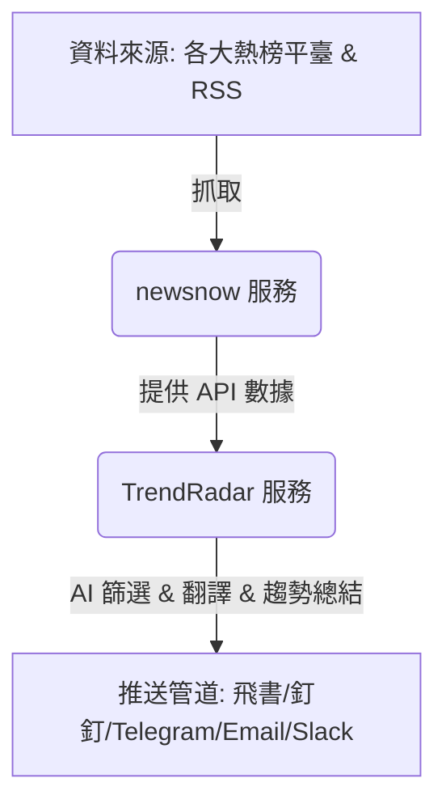

# NewsNow & TrendRadar 部署與設定指南

本指南詳細說明如何設定並串接 `newsnow` 與 `trendradar`，讓您可以自行搭建專屬的熱點新聞監控與 AI 智慧摘要分析推送系統。



## 📋 系統架構簡介
1. **`newsnow`**：負責定時爬取微博、知乎、頭條、GitHub 等各大平台的熱門榜單，並提供前端閱讀介面與 JSON API。
2. **`trendradar`**（位於 `TrendRadar-master`）：使用 Python 開發的後端服務。它會從 `newsnow`（預設使用公共端點，或指向您自建的服務）及自訂的 `RSS feeds` 讀取資料，根據您的**關鍵字**或 **AI 興趣描述**進行智慧篩選，再調用 **LLM（如 Gemini、DeepSeek 等）** 進行翻譯與摘要，最後定時推送至您指定的通訊軟體。

---

## 第一部分：NewsNow 部署與設定

`newsnow` 支援多種部署方式，最推薦使用 **Docker Compose** 本地部署，或直接託管至 **Cloudflare Pages**。

### 1. 環境變數設定
在 `newsnow` 資料夾中，找到 `example.env.server`，將其複製並命名為 `.env.server`：
```sh
cp example.env.server .env.server
```
編輯 `.env.server` 檔案，填入以下欄位（若不需要 GitHub 登入同步與快取，可保持留空）：
- `G_CLIENT_ID` / `G_CLIENT_SECRET`：若需要 GitHub 帳號同步功能，請先在 GitHub 建立一個 GitHub App，並將產生的 Client ID 與 Secret 填入。**（註：若只作為 API 數據源供本機或 Docker 本地端使用，可直接保持留空，不影響核心爬蟲與 API 功能。）**
- `JWT_SECRET`：JWT 加密金鑰，建議設定與 `G_CLIENT_SECRET` 相同。
- `INIT_TABLE=true`：首次啟動時必須設為 `true` 以初始化資料庫，初始化完畢後可改為 `false`。
- `ENABLE_CACHE=true`：是否啟用快取。
- `PRODUCTHUNT_API_TOKEN`：若需抓取 Product Hunt 資料，需填入其 API Token。

### 2. 資料庫設定 (選擇性)
`newsnow` 預設推薦使用 **Cloudflare D1 資料庫**：
- 將 `example.wrangler.toml` 複製並重命名為 `wrangler.toml`：
  ```sh
  cp example.wrangler.toml wrangler.toml
  ```
- 編輯 `wrangler.toml` 填入您在 Cloudflare 建立的 D1 資料庫的 `database_name` 與 `database_id`。

> [!NOTE]
> **💾 關於本地 SQLite 資料庫：**
> 如果您是使用 **Docker Compose**（如第四部分）或是在本地運行，**完全不需要設定 Cloudflare D1 資料庫**。
> 系統在檢測不到 D1 設定時，會自動在本地目錄（容器內的 `/usr/app/.data`）建立 SQLite 資料庫檔案。只有在需要部署至 Cloudflare Pages 雲端託管時才需要進行此 D1 資料庫設定。

### 3. 啟動 newsnow
* **方式 A：使用 Docker 部署（推薦）**
  直接在 `newsnow` 資料夾下執行：
  ```sh
  docker compose up -d
  ```
  這會在本機啟動一個監聽在 `4444` 埠的服務（http://localhost:4444）。

---

## 第二部分：TrendRadar 設定與部署 (手動本機執行)

在 `TrendRadar-master` 資料夾中，所有的主要設定都位於 `config/` 目錄下。

### 1. 設定 `config/config.yaml`
開啟 `config/config.yaml` 並依照以下四大核心模組進行調整：

#### ⚙️ A. 基礎設定與調度
- `app.timezone`: 設定為 `"Asia/Taipei"`。
- `schedule` (定時調度開關)：
  - `enabled`: 設為 `true`（啟用定時自動執行）或 `false`（每次手動執行）。
  - `preset`: 預設時間線範本，例如 `"morning_evening"`（早晚匯總）或 `"always_on"`。
  - *詳細的定時段落可在 `config/timeline.yaml` 中調整。*

#### 🌐 B. 設定資料來源 (串接 newsnow 與 RSS)
- **熱榜平臺 (`platforms`)**：
  - `enabled`: `true`
  - `api_url`: **若您在第一部分自建了 newsnow**，請填入您的 API 地址，例如：`http://localhost:4444/api/s`（若留空，則使用 `newsnow` 官方的公共 API端點 `https://newsnow.busiyi.world/api/s`）。
  - `sources`: 可視需求開啟或關閉特定平台（如微博、知乎、GitHub Trending、Reddit 等）。
- **RSS 訂閱 (`rss`)**：
  - `enabled`: `true`
  - 在 `feeds` 列表中，您可以自由加入您想監控的 RSS 網址（例如財經新聞、科技日誌、PTT 板塊等）。

#### 🤖 C. 設定 AI 模型與智慧篩選 (LLM 設定)
若您希望有 AI 協助您總結新聞趨勢、翻譯或智慧篩選：
- `ai.model`: 填入您要使用的 LLM 模型名稱，例如 `"gemini/gemini-3-pro-preview"`、`"deepseek/deepseek-v4-flash"` 或 `"openai/gpt-4o-mini"`。
- `ai.api_key`: 填入您的 API 金鑰。*(註：為了安全，您也可以直接在系統環境變數中設定 `AI_API_KEY`，而不用寫在設定檔中。)*
- **篩選策略 (`filter.method`)**：
  - `keyword`: 僅用關鍵字匹配（免費，免 AI Token）。
  - `ai`: 啟用 AI 智慧篩選（依照興趣描述篩選，會消耗 API Token）。
- **AI 翻譯與分析開關**：
  - `ai_analysis.enabled`: `true`（啟用趨勢總結分析）。
  - `ai_translation.enabled`: `true`（啟用標題翻譯）。

#### 📢 D. 設定推送管道 (`notification.channels`)
在 `notification` 區段下，選擇您要接收通知的管道並填入對應 webook 或 Token：
- **飛書 / 釘釘 / 企業微信**：在群組中建立自訂機器人（Webhook），並將 Webhook 網址貼入對應的 `webhook_url`。
- **Telegram**：填入 `bot_token` 與您個人的 `chat_id`。
- **Email**：填入 `from`（寄件者信箱）、`password`（信箱授權碼而非登入密碼）、`to`（收件者信箱）。
- **Slack** / **Bark** / **ntfy**：根據對應欄位填入 Webhook 或裝置金鑰。

> [!TIP]
> **💾 如果您只想將報告或快照寫到本地（地端），不對外推送：**
> 1. 請將 `notification.enabled` 設定為 `false`，這會關閉所有對外的通訊軟體推送。
> 2. 確保 `storage.formats.html` 設為 `false`。
> 3. 將 `storage.formats.txt` 設為 `true`（這已被我們升級優化為：直接生成包含點擊連結的 Markdown `.md` 快照報告，位置在 `output/md/`）。
> 4. 程式執行後，所有的 HTML 報表和 Markdown 快照都會默默儲存在本地的 `output/` 資料夾下（Docker 環境則會同步至本地掛載的 `TrendRadar-master/output/`），您只需直接用 Markdown 編輯器或瀏覽器開啟對應檔案即可在地端離線閱讀。

### 2. 設定篩選條件
* **如果使用關鍵字匹配 (`filter.method: "keyword"`)**：
  編輯 `config/frequency_words.txt`，在裡面直接寫下您感興趣的關鍵字（每行一個，例如：`台股`、`AI`、`Nvidia`、`半導體`）。只有包含這些關鍵字的新聞才會被篩選出來並推送給您。
* **如果使用 AI 篩選 (`filter.method: "ai"`)**：
  編輯 `config/ai_interests.txt`，使用自然語言描述您感興趣的主題或偏好。

---

## 第三部分：啟動與測試 TrendRadar (手動本機執行)

設定完成後，您可以透過以下步驟進行測試與運行：

### 1. 建立與啟用虛擬環境
若您是首次手動在本機執行，請先切換至 `flashradar` 根目錄，建立並啟用 Python 虛擬環境，然後安裝依賴套件：
```sh
cd /home/simon/Desktop/Project/test/flashradar

# 1. 建立虛擬環境
python3 -m venv venv

# 2. 啟用虛擬環境
source venv/bin/activate

# 3. 安裝依賴 (會讀取根目錄下的 requirements.txt)
pip install -r requirements.txt
```

### 2. 執行單次抓取與測試
啟用虛擬環境後，切換到 `TrendRadar-master` 資料夾並執行程式來手動測試一次完整的抓取、篩選、AI 分析流程：
```sh
cd /home/simon/Desktop/Project/test/flashradar/TrendRadar-master
python -m trendradar
```
確認您的快照檔案（`output/md/`）是否已成功生成。

### 3. 背景定時自動執行
若要讓 TrendRadar 自動定時在背景運作，請確保 `config/config.yaml` 中的 `schedule.enabled` 設定為 `true`。接著您可以使用 `nohup` 或建立 `systemd service` 將其常駐在背景：
```sh
nohup python -m trendradar > trendradar.log 2>&1 &
```

---

## 第四部分：使用 Docker Compose 一鍵整合部署 (最推薦 & 混合設定最佳實踐)

如果您希望同時執行這兩個服務，且避免在本機安裝複雜的 Node.js 或 Python 依賴，我已經在專案根目錄（`flashradar/`）為您建立了整合版的 **`docker-compose.yml`**。

它會同時啟動三個服務：
1. **`newsnow`**: 執行於 `http://localhost:4444`（資料源與前端）。
2. **`trendradar`**: 執行排程與推送主程式。
3. **`trendradar-mcp`**: 執行於 `http://localhost:3333`（MCP 伺服器）。

> [!TIP]
> **💡 混合設定最佳實踐：**
> * **安全金鑰**（如 API 金鑰、Webhook 網址）可以**直接寫在環境變數或 `.env` 檔案中**，由 Docker 容器內部自動覆蓋，不需要寫在設定檔中，確保安全性。
> * **功能與內容設定**（如 RSS 新聞源列表、時間調度、監控關鍵字）則需要**到本地 `config/` 資料夾下修改**，修改後會即時同步給容器。

---

### 1. 步驟一：修改 `config.yaml` 讓容器內部對接
當使用 Docker 容器時，`trendradar` 容器可以直接透過 Docker 內部網絡存取 `newsnow`。
請開啟 `TrendRadar-master/config/config.yaml` 並修改以下欄位：
```yaml
platforms:
  enabled: true
  api_url: "http://newsnow:4444/api/s"  # 將 api_url 指向 newsnow 容器名稱與埠口
```

### 2. 步驟二：在根目錄建立 `.env` 檔案管理金鑰
在根目錄 `flashradar/` 建立一個 `.env` 檔案，填入您的敏感金鑰。**在 `.env` 中設定的欄位，在本地 `config.yaml` 內對應的欄位（例如 `api_key` 與各 `webhook_url`）直接保持留空 `""` 即可：**
```env
AI_API_KEY=your_gemini_or_deepseek_api_key
FEISHU_WEBHOOK_URL=your_feishu_webhook_url
# ...其他想透過環境變數傳遞的值，可參考 docker-compose.yml 中的 environment 區段...
```

### 3. 步驟三：在本地資料夾調整訂閱源與關鍵字
在本地 `TrendRadar-master/config/` 資料夾下：
* 編輯 `config.yaml`：調整 `rss.feeds` 列表，加入您想監控的台灣 RSS 來源。
* 編輯 `frequency_words.txt`：加入您關注的中文關鍵字。
* 編輯 `ai_interests.txt`：寫下您的 AI 智能篩選興趣偏好。

### 4. 步驟四：一鍵啟動與運作管理
在根目錄 `flashradar/` 執行以下指令：
```sh
# 啟動所有服務（背景執行）
docker compose up -d

# 檢視運行日誌
docker compose logs -f

# 查看容器狀態
docker compose ps

# 停止並刪除容器
docker compose down
```

---

> [!NOTE]
> - 如果您只想要最簡單的關鍵字篩選與推送，可以直接關閉 AI 功能（將 `ai_analysis.enabled` 和 `ai_translation.enabled` 設為 `false`，並使用 `keyword` 篩選），這完全不消耗 any token。
> - `newsnow` 是 `trendradar` 的資料來源之一，但非唯一來源。若您關閉了 `platforms` 僅使用 `rss`，甚至不設定 `newsnow` API 也能正常抓取 RSS 內容。
